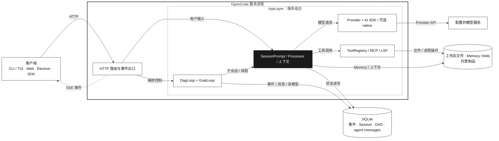

# GraphAgent v1 架构

> 核对日期：2026-10-03 · 基线：`main` @ `10806c9ad7`
>
> [打开 HTML 架构图](./architecture.html)

本文概述 GraphAgent 的主要运行边界、数据流和源码入口。图中的方框表示逻辑模块。AppLayer 框表示服务组合。数据库与文件作为共享资源单独画出。

## 总览

SSE 是服务端事件流。DAG 是有向无环图。Session（会话）保存一次持续交互的消息、配置与运行状态。Effect 是服务端使用的异步与依赖组合库；AppLayer 将服务依赖组合成运行环境，图中组件按职责分组。客户端通过 HTTP 调用服务，服务通过 SSE 推送事件。终端 PTY 使用单独的 WebSocket 路由。

## 组件与目录

| 边界            | 职责                                                                                                                      | 主要源码                                                                                                                                                                                                                                |
| --------------- | ------------------------------------------------------------------------------------------------------------------------- | --------------------------------------------------------------------------------------------------------------------------------------------------------------------------------------------------------------------------------------- |
| 客户端          | CLI/TUI、浏览器应用、Electron 桌面端和 SDK 调用方呈现或调用会话能力。                                                     | [`packages/tui`](../packages/tui)、[`packages/app`](../packages/app)、[`packages/desktop`](../packages/desktop)、[`packages/sdk/js`](../packages/sdk/js)                                                                                |
| HTTP 与事件 API | 路由接收客户端请求，调用应用服务并返回响应；事件端点发送实时更新。                                                        | [`packages/opencode/src/server/routes`](../packages/opencode/src/server/routes)、[`packages/protocol`](../packages/protocol)                                                                                                            |
| AppLayer        | 组合服务依赖并管理资源生命周期，包括 DAG 存储、消息服务、DAG 服务和 Goal 服务。                                           | [`app-runtime.ts`](../packages/opencode/src/effect/app-runtime.ts#L68)、[`ManagedRuntime`](../packages/opencode/src/effect/app-runtime.ts#L154)                                                                                         |
| Session         | 整理提示词和上下文，运行模型交互、工具调用及会话状态更新。                                                                | [`packages/opencode/src/session`](../packages/opencode/src/session)                                                                                                                                                                     |
| DAG / Goal      | DAG Loop 管理工作流状态与调度；Goal Loop 在会话空闲时判断是否继续目标。                                                   | [`packages/core/src/dag`](../packages/core/src/dag)、[`packages/opencode/src/dag`](../packages/opencode/src/dag)、[`packages/opencode/src/goal`](../packages/opencode/src/goal)                                                         |
| 模型与工具      | Provider 选择模型客户端；Session 可经 AI SDK 或配置支持的 native 客户端请求模型。工具注册表连接内建工具及 MCP、LSP 能力。 | [`provider.ts`](../packages/opencode/src/provider/provider.ts#L1834)、[`llm.ts`](../packages/opencode/src/session/llm.ts#L303)、[`tool`](../packages/opencode/src/tool)                                                                 |
| 持久化与文件    | SQLite 保存事件、会话、DAG 投影和 agent 消息；工作区文件、Memory 数据及托管制品位于文件系统。                             | [`packages/core/src/dag`](../packages/core/src/dag)、[`messages.ts`](../packages/core/src/dag/messages.ts#L436)、[`output-ref.ts`](../packages/opencode/src/dag/runtime/output-ref.ts#L42)、[`memory`](../packages/opencode/src/memory) |

## 客户端与协议

TUI 和 Web 应用都使用 HTTP SDK 访问服务。TUI 在 [`context/sdk.tsx`](../packages/tui/src/context/sdk.tsx#L37) 以服务 URL 创建客户端，并在 [`context/sdk.tsx`](../packages/tui/src/context/sdk.tsx#L107) 订阅事件流。Web 应用按服务连接创建 SDK，并可为不同服务或目录建立独立上下文：[`utils/server.ts`](../packages/app/src/utils/server.ts#L20)、[`context/server-sdk.tsx`](../packages/app/src/context/server-sdk.tsx#L57)。

Electron 桌面端可启动本地 sidecar 服务，再通过本机 HTTP 与它通信；也支持连接 HTTP 服务或经 SSH 暴露的 HTTP 代理。sidecar 由 Electron utility process 启动：[`server.ts`](../packages/desktop/src/main/server.ts#L55)、[`server.ts`](../packages/desktop/src/main/server.ts#L142)、[`server.ts`](../packages/app/src/context/server.tsx#L147)。

`packages/protocol` 使用 Effect HttpApi 定义选定 API 组和中间件边界：[`api.ts`](../packages/protocol/src/api.ts#L25)。事件组声明 `/api/event` 及其事件 schema：[`event.ts`](../packages/protocol/src/groups/event.ts#L35)。运行时还提供更广的 HTTP API 表面；OpenAPI 与 SDK 生成入口可从 [`public.ts`](../packages/opencode/src/server/routes/instance/httpapi/public.ts#L1) 和 [`packages/opencode/script`](../packages/opencode/script) 查起。

两个生成客户端面向不同用途。`packages/client` 从服务端的 session API 组生成 Promise 客户端和 Effect 客户端：[`build.ts`](../packages/client/script/build.ts#L8)。公开的 JavaScript SDK 从运行时生成的 OpenAPI 文档生成 v2 客户端：[`build.ts`](../packages/sdk/js/script/build.ts#L12)。

## DAG、Goal 与模型调用

DAG 的状态机、存储和投影机制位于 `packages/core/src/dag`；运行循环和调度协调位于 `packages/opencode/src/dag`。DAG Loop 负责工作流生命周期和节点调度，调度核心读取依赖状态并选择可运行节点：[`scheduling.ts`](../packages/core/src/dag/core/scheduling.ts#L18)、[`loop.ts`](../packages/opencode/src/dag/runtime/loop.ts#L287)。

每个 DAG 节点在独立子会话中执行。创建子会话时记录父会话关系，随后调用 Session prompt 流程：[`spawn.ts`](../packages/opencode/src/dag/runtime/spawn.ts#L565)、[`spawn.ts`](../packages/opencode/src/dag/runtime/spawn.ts#L636)。模型层级由 DAG 配置决定：标记为必需的节点及审查/仲裁节点使用 `advanced`，其他节点使用 `standard`。调度在启动节点前取得并发许可。

GoalLoop 管理单会话目标的持续推进。它在会话空闲时执行准入判断，再决定是否续跑：[`loop.ts`](../packages/opencode/src/goal/loop.ts#L148)、[`loop.ts`](../packages/opencode/src/goal/loop.ts#L556)。

Session 将提示词和上下文交给模型调用层。Provider 提供配置好的模型客户端。默认路径使用 AI SDK 的 `streamText`。启用 `experimentalNativeLlm` 后，支持的请求可经 `packages/llm` 调用原生模型接口。不支持的请求回退 AI SDK。两条路径共享 `LLMEvent` 事件接口：[`llm.ts`](../packages/opencode/src/session/llm.ts#L303)、[`llm.ts`](../packages/opencode/src/session/llm.ts#L370)、[`native-runtime.ts`](../packages/opencode/src/session/llm/native-runtime.ts#L175)。

## 状态与制品

核心 DAG 事件在事务中持久化并更新读模型。工作流事件从 DAG 服务发布，agent 消息也保存到 SQLite：[`event/sql.ts`](../packages/core/src/event/sql.ts)、[`dag.ts`](../packages/opencode/src/dag/dag.ts#L540)、[`messages.ts`](../packages/core/src/dag/messages.ts#L436)。节点输入快照固定节点执行所用的输入版本，相关提示词组装逻辑位于 Session prompt 路径：[`runtime/spawn.ts`](../packages/opencode/src/dag/runtime/spawn.ts#L560)、[`prompt.ts`](../packages/opencode/src/session/prompt.ts#L1875)。

较大的文件型节点输出可以保存为托管制品。运行时复制内容、计算 SHA-256 并记录大小和来源；下游读取前验证制品：[`output-ref.ts`](../packages/opencode/src/dag/runtime/output-ref.ts#L42)、[`output-ref.ts`](../packages/opencode/src/dag/runtime/output-ref.ts#L136)、[`spawn.ts`](../packages/opencode/src/dag/runtime/spawn.ts#L560)。制品内容保存在应用数据目录的 workflow artifact 存储中。

Memory 以主题 YAML 和 manifest generation 文件保存。主 Session 将 Memory 内容注入提示上下文：[`store.ts`](../packages/opencode/src/memory/store.ts#L214)、[`home.ts`](../packages/opencode/src/memory/home.ts#L20)、[`system.ts`](../packages/opencode/src/session/system.ts#L181)、[`prompt.ts`](../packages/opencode/src/session/prompt.ts#L2341)。

## 源码与领域文档

按依赖关系阅读时，可先看 core 的数据模型和调度机制，再看 OpenCode 的服务组合及循环，最后看 Session 与客户端边界。下面的领域文档补充行为约定和已记录的架构决策。

- [DAG 核心](../packages/core/src/dag)：状态、调度、持久化与投影。
- [DAG 运行时](../packages/opencode/src/dag)：循环、节点执行、恢复和输出处理。
- [Goal 运行时](../packages/opencode/src/goal)：单会话目标循环。
- [Session 运行时](../packages/opencode/src/session)：提示词、上下文、模型交互和工具执行。
- [Effect 运行时说明](../packages/opencode/specs/effect/migration.md)：服务组合与运行时约定。
- [DAG 系统评审](./dag-system-review-2026-08-09.md)：DAG 架构观察与缺陷审查记录。
- [DAG harness](./harness-dag.md)：deep-mode 准入和审查生命周期。
- [工作流配置仓库](https://github.com/LeXwDeX/opencode-dag-config)：维护 curated workflow YAML、可组合 blocks 与 worker prompts。

MCP（Model Context Protocol）连接外部工具服务。LSP（Language Server Protocol）提供语言服务器能力。PTY 指伪终端。
