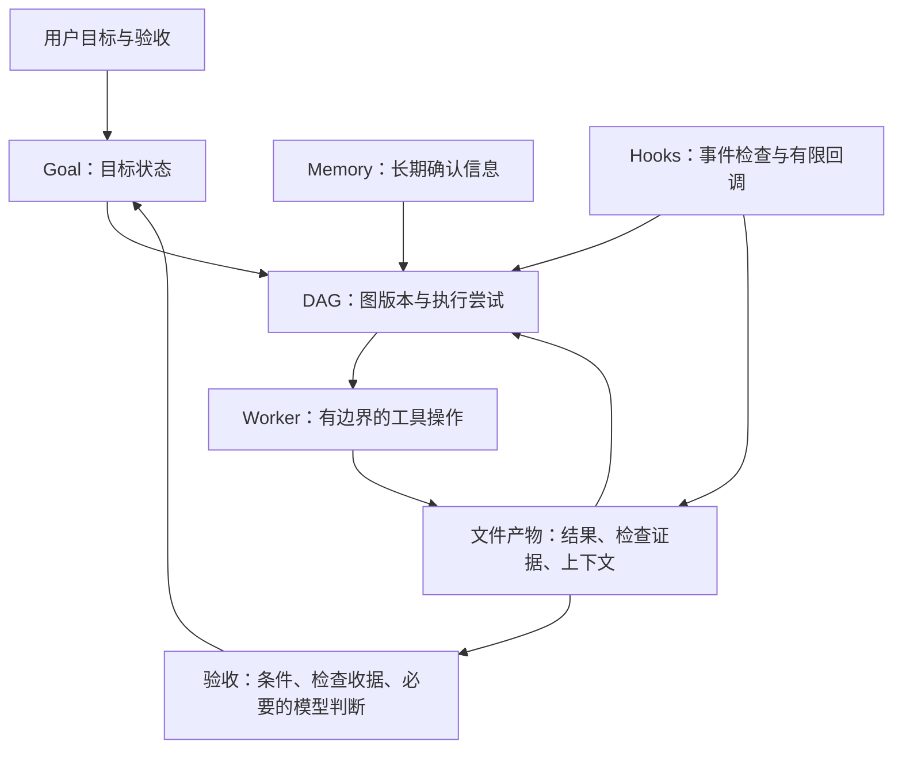

# 核心产品审查：DAG、Memory、Goal、Hooks 与 Tools

日期：2026-09-12。源码基线：`b19b78849590b62aa70a9fb8dee13bb96c1573da`；下文原行为的源码行号以该基线为准，修复以本地 diff 为准。以下区分现有行为、此次本地修复和后续设计。没有把本地测试当成发布或真实模型验收。

## 1. 核心判断

应沿现有 DAG 增量演进：**一个目标对应一个可持续推进的工作流，节点分次尝试，成果通过文件交接，失败只修复受影响的工作。** 现有事件、图版本、结果存储、恢复和 wake 机制可以保留。

目前的主要障碍不是缺少 DAG，也不是完全没有持久化，而是：

1. 失败尝试、逻辑任务、整个工作流的终态绑定过紧；恢复通常要求 Agent 手动改 ID、重接依赖，失败工作流还要求新建。
2. 文件结果只是可变绝对路径的提交时收据，尚未成为带版本、依赖和生命周期的任务产物。
3. 默认编排深度、上下文重复注入、多个自动续跑来源，让 Agent 花时间重复转述和恢复调度细节。
4. Tools 的恢复、搜索、输出协议会反过来影响上述产品行为，需要一起修。

## 2. 五个模块的职责

| 模块 | 已有能力 | 应当负责 | 不应承担 |
| --- | --- | --- | --- |
| DAG | 条件依赖、并发、图版本、replan/extend、暂停、恢复、结构化结果、wake | 工作分解、执行尝试、依赖与成果是否可复用 | 让父 Agent 反复复制完整计划和输出 |
| Memory | Project 级共享、主题存储、版本提交、身份迁移、匹配与维护 | 已确认的长期偏好、决策、术语 | 当前任务进度、失败节点缓存、任意工具输出 |
| Goal | Session 持久目标、预算、idle 续跑、judge、暂停和恢复 | 目标和验收标准，决定目标是否还有工作 | 第二套节点调度器，凭反复转述替代证据 |
| Hooks | 事件 handler、同步门禁、异步输出/rewake、动态注册、热重载 | 事件检查、证据采集、有限的后续动作请求 | 无预算地启动另一条自主任务循环 |
| Tools | 文件操作、搜索、任务、workflow、goal、结果提交和输出截断 | 提供明确可组合的操作和结果收据 | 吞掉恢复错误、悄悄扩大搜索范围、强制新委派 |

建议的数据流：



这是建议职责图，并非声称现有 Goal judge 已读取文件产物。

## 3. 优先解决的产品问题

### P1-D1：失败恢复迫使 Agent 重建调度结构

现状：

- `planReplan` 只允许 running 节点 `restart`；terminal 节点不能重启。缺席的 pending/queued/paused 节点会被取消。
- `Dag._replan` 拒绝失败、取消等终态工作流。
- `extend` 只有狭窄例外：在自然完成的 reporting leaf checkpoint 后追加新 ID，允许重新打开 completed 工作流；failed/cancelled 不适用。
- `workflow` 的错误信息明确建议新建工作流并手工把既有结果作为静态输入。

证据：`packages/core/src/dag/core/replan.ts:14-30,133-140`；`packages/opencode/src/dag/dag.ts:607-620,845-919`；`packages/opencode/src/tool/workflow.ts:647-654,717-720`。

**建议：把失败保持在 attempt 层，把继续工作的入口放在稳定 workflow 身份上。** 不覆盖旧终态事件；一次重试追加新 attempt 或图 revision，旧证据继续可查。取消和归档仍要求明确的恢复意图，不能自动复活。

第一版可复用现有“新节点 ID + superseded revision”的底层机制，通过逻辑节点身份和一个恢复入口封装；不必立即重写全部存储表。是否最终独立 attempt 表，由并发隔离和查询需求决定。

用户可见行为：`恢复这个任务` → 展示/执行局部修复范围 → 复用有效结果 → 只执行失败点及需要重新验收的下游。无需重新选择模板、重填目标或重新 BUILD 全图。

### P1-D2：replan 的“省略即取消”让动态修改成本过高

小修改也要求 Agent 重写要保留的未执行节点，否则其被取消；running 节点的缺席规则又不同。这是合法的现有契约，但与“只描述变化”的心智模型相冲突。

建议增加显式的增量修改契约：add/update/cancel/retry，**省略默认保留**。旧 replan 保持兼容；新入口携带 `expected_graph_rev` 并返回变更预览/实际影响范围，拒绝基于旧版本的覆盖。暂停、修改、恢复应由一个操作完成必要的调度协调，减少父 Agent 的控制往返。

不要简单删除现有 pause/fence：等待写文件期间正在完成的节点、迟到的旧子会话结果、并发用户取消，都必须有明确归属。

### P1-D3：文件引用还不是持久化成果

现有 `captureOutputFileRef` 仅在无 `output_schema` 节点的回复恰好是一个无空白绝对路径时识别文件；记录 size、sha256 和 200 字符摘要。文件缺失、为空、过大等情况回落为普通文本。`workflow result` 返回提交时路径和摘要，并不在该读取边界重新校验内容。结构化节点走另一条 JSON 输出路径。

证据：`packages/opencode/src/dag/runtime/output-ref.ts:29-42,82-115`；`packages/opencode/src/dag/runtime/spawn.ts:611-638`；`packages/opencode/src/tool/workflow.ts:478-511`。这是对这些已检查路径的结论，不等于其他文件读取工具没有权限检查。

因此：DB 中还存着路径，不代表工作区被删除、文件被覆盖后仍能恢复。现状足够交接短期报告，不足以保证“不为失败重做已完成工作”。

建议详见第 4 节。保留 YAML 描述和普通 Read/Write 操作，但给完成产物增加受运行时管理的版本和提交收据。

### P1-X1：自动化来源和人类来源必须分开

Goal 的自动 continuation 原先是普通 user text，Memory 会把它当作人类输入。交叉测试证实它进入 `Memory.cleanEvidence` 的 `user:` 内容，并影响人类轮数计算。此次修复给自动 continuation 标记 `synthetic: true`，模型仍收到内容；真实用户输入不受影响。

这证明“减少重复”不只是删 prompt：必须在产生内容的边界保留来源，不能让 Memory 再猜是哪种输入。没有证据证明某个真实模型已把错误主题永久写入 Memory，本报告不作该推断。

### P1-X2：Hooks 自动链必须有边界

真实 `SessionPrompt` + 本机假模型复现：一个异步 Stop hook 持续返回消息，单次用户输入引出 8 次模型调用，超过 `MAX_STOP_CONTINUATIONS=5`；每次 Stop 的 `stop_hook_active` 都是 false。异步 rewake 开始新 prompt，绕过了原先只管当前调用的计数。

修复采用同一自动链共享的预算及新 prompt 的代次隔离，保留正常异步回调。Hook handler 的幂等性、持久队列和跨进程恢复仍属于后续工作，不能由本次循环修复推导为已具备。

长期方向：Hook 返回“发生了什么、对应哪个任务/attempt/产物版本、是否需要处理”；由已有自动化入口决定推进。不要让普通日志默认成为新的模型任务。

### P2-D4：动态编排应由证据推动，而非按目录大小强制加层

当前 Router 对项目内单文件变更也默认选择 DAG；Policy 对 file/module/subsystem 规定最小波次与汇总层次，`/dag-auto` 对宽泛任务默认整条 ultra-flow。另有“最小合理图”和 progressive guide，因此并不是每次都加载所有指南，但这些默认规则仍可能增加重复分析。

证据：`packages/core/src/plugin/command/workflow-routing.md:8-20,73-87,121-128`；`orchestration-policy.md:41-52`；`dag-auto.txt:11-25`。

建议先建最小可执行 wave；只有发现具体不确定性、修改风险、验收失败或可独立分工时才增加节点。保留必要的独立审查，但下一轮消费已有 findings/证据，只检查新增变化，避免再次全量分析。

这轮没有批量删除编排政策。实际收益应在同一组任务上比较模型调用数、重复扫描、结果复用与验收质量，不能把节点少直接当准确率高。

### P2-G1：Goal 验收目前偏重叙述，容易要求重复汇报

GoalLoop 取最后 assistant 文本的末尾 4000 字符交给 judge；工具结果和文件内容并不通过该接口自动进入 judge。`goal complete` 也以 reason 文本完成目标。现有持久 Goal/预算/已判断消息 fencing 应保留。

证据：`packages/opencode/src/goal/loop.ts:337-396`；`packages/opencode/src/goal/prompts.ts:137-152`；`packages/opencode/src/tool/goal.ts:108-133`。

建议把可机器判断的验收项绑定到 DAG 节点、产物和检查收据：版本是否匹配、测试是否成功、必需结果是否齐全；模型仅判断剩余语义条件。工具成功、节点结束和用户目标完成仍是不同事实。

自动 continuation 也可进一步缩为短唤醒，动态 system block 持有当前目标。此次 synthetic 修复减少的是可见重复和 Memory 误入，不宣称已减少 continuation 的模型 token。

## 4. 文件交接与局部恢复的具体设计

### 4.1 三类文件，三个写入责任

| 文件类别 | 写入者 | 用途与生命周期 |
| --- | --- | --- |
| workflow spec / patch YAML | 父 Agent 经 authoring 检查 | 声明目标、节点和变更；不直接修改执行状态 |
| node 工作文件 | 当前 worker | 记录调查、实现说明、证据、检查点；在分配给自己的 attempt 目录内写入 |
| 已提交成果与 context manifest | 运行时 | 冻结结果版本，记录依赖收据，组装下游输入；普通 worker 不编辑调度状态 |

建议逻辑目录（尚未实现，路径名可随实现调整）：

```text
<data>/workflow-artifacts/<project>/<workflow>/
  attempts/<logical-node>/<attempt>/draft/   # worker 写入中的文件
  objects/<digest>/report.md                # 提交后不可变副本
  manifests/<graph-rev>/<node>/<attempt>.json
```

任务工作区可以保留可读导出，但权威成果应能脱离临时 worktree 存活。Project Memory 使用自己的目录与保留策略，两者不混用。清理依据是任务/产物引用和用户保留策略，不能直接沿用短期工具输出的 7 天清理。

### 4.2 传递短收据，按需读正文

下面是**拟议的结果契约**，并非当前工具已接受的 schema：

```json
{
  "summary": "已定位到输入校验缺口，并完成针对性修复",
  "artifacts": [{"id": "report", "path": "report.md"}],
  "checks": [{"name": "targeted-tests", "result": "passed", "evidence": "tests.log"}]
}
```

worker 通过 Write/Edit 写正文，只提交一次短摘要和文件引用。运行时添加 project/workflow/node/attempt、源代码版本、输入产物 digest、实际文件大小和摘要校验值；这些系统字段不用模型手写。结构化 verdict 仍用于条件分支，正文可以同样放文件。

下游得到一份 context manifest：当前任务、约束、前序完成事实、所需文件路径与版本、遗留问题、这次只需做的差量。模型按需要用 Read/Grep，不把全部上游正文再粘贴到 prompt。文件中的文本是任务资料，不能提升为系统指令。

### 4.3 提交与崩溃边界

1. 运行时验证 worker 提交的文件归属、存在性、大小和结构。
2. 将成果复制/原子落盘到不可变版本；需要明确落盘成功的边界。
3. DB 事务追加成果收据及节点完成事件，并核对当前 attempt/fence。
4. 后续消费者只使用已提交收据。文件已落盘但事务未提交的对象可回收；不能先标完成再异步补文件。
5. 文件缺失或 digest 不匹配时显示“成果不可用/已改变”，不能沿用旧成功状态作为有效验收证据。

运行中的未完成代码改动也是副作用。重试前应检查当前工作区差量和检查点，不能仅因为缺少 `submit_result` 就重放写操作。节点成功提交与实际外部操作恰好执行一次是两个问题。

### 4.4 何时复用，何时重新执行

复用需同时满足：节点工作定义仍有效、所声明输入版本未变、相关代码/环境依据仍适用、产物完整。首先只在同一工作流显式依赖范围内复用，不引入跨项目全局结果缓存。

- 暂时执行失败：建立新 attempt，保留检查点，重试该节点。
- 修改设计或代码：使依赖其变化的结果/验收失效；无关完成节点保留。
- 仅结果提交失败：优先在原会话补交或从已完成工作恢复结果，避免重新实现。现有 spawn 已有一次同会话 `submit_result` 补交提示，可以沿用。
- 业务 verdict 为 REVISE：追加纠正 wave，与执行失败分开表示。
- 用户取消：停止推进；只有显式恢复才开始新尝试。
- 每条纠正链有预算、次数和停止原因；“动态”不意味着无限自我重规划。

### 4.5 验收场景

以“分析 A → 实现 B → 验证 C → 汇总 D”为基准：

1. C 失败后恢复：A/B 不再次启动，C/D 按有效性执行；同一目标和工作流仍可追踪。
2. 进程在文件提交和事件提交之间崩溃：重启不得出现虚假成功或吞掉已提交成果。
3. B 输入/实现版本变化：旧 C 的 PASS 自动失效，不能用旧测试结果验收新代码。
4. 用户追加一个独立模块：增量添加，不取消无关 pending 节点。
5. 旧 attempt 迟到返回：不能覆盖新 attempt 的结果。
6. 删除临时 worktree 后：任务结果仍可读；执行续跑仍要求有效代码工作区。
7. 重复 wake/Hook 回调：同一来源只获得有限、可说明的推进，不引出无限模型调用。
8. 长报告：正文只存一份，提示传引用；记录实际输入字节/token、读取范围、模型调用及结果质量。

## 5. 内部 Tools 的统一优化

当前 Session 使用 `packages/opencode/src/tool/registry.ts`（`src/session/tools.ts:10,99`）；仓库另有 canonical core tools。两套代码存在不代表同一模型实际收到重复工具，因此本轮不做跨 registry 合并。

| 工具面 | 本轮发现/处理 | 后续统一契约 |
| --- | --- | --- |
| `workflow` | 有 start/extend/replan/status/result，缺少模型可用的运行中任务发现入口；list 目前列保存模板 | 明确区分模板库和运行任务；恢复返回复用/失效/将执行节点清单 |
| `task` | 显式 task_id 查询错误原先回落新建，违反继续原任务的意图 | 显式恢复失败应报错，不能静默新建；有效任务继续用原有子会话 |
| `read` / `grep` | 已有文件读取和有界输出；grep 单文件目标原先被扩大到父目录 | 单文件、目录和分页目标保持精确；指向产物时携带版本 |
| 长工具输出 | 已落盘，有 Read/Grep 入口；有 task 权限时原先强制委派 | 返回结果位置与读取方式，委派由父任务决定；短期输出可显式提升为长期任务产物 |
| `submit_result` | 已单一结构化提交，有校验错误反馈，成功只返回短回执 | 同一 envelope 支持 verdict + artifacts；模型不重复完整报告 |
| 写入与修改 | `edit/write/apply_patch` 已按模型能力投影，叶子仍负责权限 | 保留文件并发/过期检查；不要新增万能 `execute` 绕开这些边界 |
| 搜索与输出分页 | legacy grep/glob 100 条后要求缩小范围；原始数据不足时不应声称完整 | 稳定 cursor 或明确的缩小范围方式，区分采集丢失和展示截断 |

所有新增动作建议返回同一组概念：操作是否生效、操作/产物身份、版本、变化摘要、是否还能重试、确切下一步。兼容现有工具时按入口逐个演进，不一次替换全部 schema。

## 6. 实施顺序

1. **当前局部修复**：DAG prompt 去重；Goal 自动来源；Hooks 无限续跑；Task 恢复不静默新建；Grep 单文件精确性；长输出不强制委派。它们不依赖新的 DAG 状态模型。
2. **文件成果协议**：先在现有节点结果存储之上增加管理文件、短收据和恢复检查；同时保留 inline JSON/旧文本兼容。
3. **稳定身份下的局部恢复**：利用 revision/attempt 和现有 fencing，增加恢复与显式增量修改，不改写旧终态历史。
4. **证据驱动的动态 wave**：调整 Router/模板默认策略，让 Goal 验收消费同一成果；最后用实际任务比较成本和质量。

初始分析阶段，第 2–4 项尚未实现；用户随后选择本次发布实现文件成果持久化和局部恢复，实施进展见第 8 节。不能为了节省重跑，把旧结果无条件当作新版本有效证据。

## 7. 初始分析阶段的证据与验证记录

结构调查采用 Tier 2 图查询、调用链与具体源码。图代次从 `2026-09-10T06:43:28Z` 自动刷新到 `2026-09-12T08:28:12Z`；相关路径做 coverage 检查。`memory.ts` 初始元数据变化已直接读源码；`authoring.ts:223` 的部分解析缺口已直接检查；非代码指南和未追踪覆盖信号也按实际文件读取。没有把“无记录缺口”当成完整性证明。

覆盖的是五个核心功能的产品行为、入口及关键交互，未声称穷尽仓库所有子包、所有 provider、真实模型质量或 UI 实机体验。性能结论限于明确减少重复输入/无用调用；没有虚构百分比或线上收益。

本地修复及回归：

| 修复 | 可证实的变化 |
| --- | --- |
| DAG 上下文去重 | 真实 `DagLoop → SessionPrompt` 边界中，同一插值字符串/结构结果由两份变为一份；未插值、静态覆盖和 review 原始证据仍保留 |
| Goal 自动来源 | 自动 continuation 不进入人类 Memory 证据或人类轮数统计，仍进入模型；人类文本继续保留 |
| Hooks 续跑边界 | 同链最多 5 次异步 Stop/SubagentStop 续跑；新非 Hook prompt、SessionEnd、InstanceDispose 使旧回调失效；新非 Hook prompt 包括 Goal continuation |
| Task 显式恢复 | 目标不存在、数据库 defect、中断均不新建替代子会话；合法 resume 和后台更新保持 |
| Grep 精确目标 | 指定文件只搜该文件；缺失路径报错，不再搜索兄弟文件；目录 include 和权限测试保持 |
| 工具截断提示 | 保留完整落盘输出和 Read/Grep 入口，删除强制委派；保留现有接口和清理策略 |

初始六项修复的统一测试命令（在 `packages/opencode` 执行）：

```sh
bun test --timeout 30000 --only-failures \
  test/dag/dag-input-mapping-runtime.test.ts test/dag/dag-templates.test.ts \
  test/dag/dag-schema-prompt-contract.test.ts test/dag/dag-goal-wake-retrigger.test.ts \
  test/goal test/memory/memory.test.ts test/session/message-v2.test.ts \
  test/hook test/tool/task.test.ts test/tool/grep.test.ts test/tool/truncation.test.ts
```

- 初始修复验证：**532 pass，0 fail，1222 assertions，36 个测试文件**，52.59 秒。
- 首次沙箱执行 11 项本机服务启动失败；允许 localhost 模拟服务后重跑全部通过，没有把首次失败隐去。测试使用本机模拟 LLM，不是付费模型质量验收。
- `packages/opencode` 的 `bun run typecheck` 通过。
- 根目录 `bun run lint` 通过：4840 warnings，0 errors，未提高 4850 的现有上限。
- `git diff --check` 通过。
- 验证使用本机 **Bun 1.4.0**；仓库固定 **1.3.14**。没有修改固定版本，固定版本 CI 和真实安装运行验收仍未执行。
- 上述是初始六项修复阶段的验证记录，未包含随后实现的文件成果和局部恢复。
- 初始分析结束时改动留在工作区；后续交付状态见第 8 节。

工具文本变更的证据、预测和证伪方式另见 [Tools 修订记录](tools-evolve-summary-2026-09-12.md)。


## 8. 后续实施范围与交付状态

用户已明确选择“六项修复＋文件成果持久化＋局部恢复，再发布”，并要求仓库升级到 SpecGit 2。

- 文件成果首版沿用无 `output_schema` 节点最后回复一个绝对路径的契约，支持含空格路径。运行时把非空、上限 64 MiB 的文件复制到 Global data，完成事件与 digest/size/provenance 收据同事务记录；正文通过短路径交接，读取和复用前校验。
- `workflow control(recover)` 在同一 workflow 中创建新的逻辑节点 attempt 和图 revision，保留旧事件与无关的有效结果。所选节点及下游同时失效，`expected_graph_rev` 与 workflow/node sequence 拒绝过期并发修改；取消后恢复须显式意图。
- 真实 Loop 测试证明 C 失败后仅启动 C/D 新 attempt，A/B 不重跑；删除原报告后，新 attempt 仍可通过 Read 读取管理成果。恢复上下文实际进入模型提示，要求检查旧会话和当前副作用。
- Hooks 复核补充了 `StopFailure` 错误路径：同样纳入共享自动链预算，持续模型错误不再绕过次数上限。
- 本次未增加通用 `artifacts` JSON envelope、attempt draft 目录或 context manifest；没有自动判断任意代码/环境变更后哪些结果仍有效，也没有实现 Goal 的机器检查收据验收或新的全局编排策略。第 4 节仍是比首版更完整的后续设计，不能视作全部已交付。

操作与边界见 [DAG 文件成果和局部恢复](dag-file-artifacts-and-recovery.md)。固定 Bun 1.3.14 的模块回归及最终 DAG core 行为/覆盖率门禁已通过。独立权限复核 25 项测试通过；root typecheck 的 29 个包通过，lint 为 0 errors / 4844 warnings，未提高 4850 上限。本机 CLI 已构建并通过 1.0.44 版本和帮助启动检查；在隔离目录完成数据库初始化，健康接口返回 HTTP 200、healthy=true、version=1.0.44。原生产品 CI 和正式版本发布仍在进行，以最终 release 记录作为发布完成证据。
