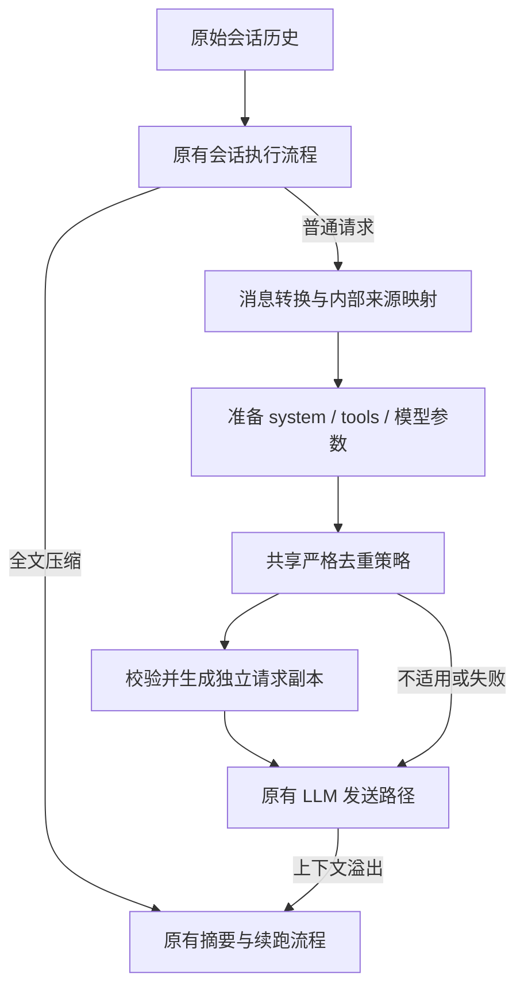

# 内置动态上下文折叠：开发设计与验收规格

- 日期：2026-09-16
- 状态：S01 接入契约已核实，产品实现仍待开始；本文不代表功能已经上线或通过运行验收。
- 调研基线：`4b554abd9dac6ae93c46b555b60dcb478eff7be6`（`origin/dev`，2026-09-16 实时核对）。
- 产品：GraphAgent / OpenCode fork。
- 首版目标：增加保守、被动、默认开启的系统内置重复输出去噪；保留现有全文主动压缩和自动溢出处理。
- 本次交付：开发文档，不修改产品代码、不迁移用户配置、不部署。

## 1. 产品决策与设计哲学

有限上下文应优先容纳有效信息。同一成功读取的完整结果重复出现时，旧正文可以让位，但执行事实、输入、最新完整结果和原始历史必须保留。

首版将“保守”落实为可验证的替代关系：只有本次请求中存在后续完整、完全相同的合格结果，才能折叠旧副本。仅仅古老、很长或看起来无关，不构成折叠依据。

全文压缩负责摘要与容量恢复；动态折叠负责普通请求中的重复正文去噪。两者独立配置、分别验收，不能将动态折叠成功等同于请求必然装入窗口。

### 1.1 已确定的首版边界

| 编号 | 决策         | 必须满足的约束                                               |
| ---- | ------------ | ------------------------------------------------------------ |
| P01  | 内置         | 不依赖外部 DCP 包、插件加载或 experimental hook 推测请求阶段 |
| P02  | 默认开启     | 无显式关闭配置时生效；尊重已有关闭清理的明确配置             |
| P03  | 被动         | 仅在原本就要发送的普通模型请求准备阶段工作                   |
| P04  | 严格去重     | 只折叠有后续完整替代副本的重复工具正文                       |
| P05  | 保护优先     | 预算不足也不降低保护、不删除唯一内容                         |
| P06  | 请求隔离     | 不写回历史、不追加持久化折叠标记、不改变会话事件             |
| P07  | 连续执行     | 不停止、取消、重启任务，不改变工具结算与重试语义             |
| P08  | 独立全文压缩 | 保留 `/compact` 等现有入口及自动压缩、溢出恢复和续跑         |
| P09  | 可关闭       | 关闭只停止后续动态折叠，不撤销既有全文摘要或历史清理         |
| P10  | 安静运行     | 无逐次弹窗、对话注入或模型主动清理工具                       |

### 1.2 明确排除

- 去重不足时按时间清理唯一结果。
- 相似文本、部分段落、跨工具或跨会话去重。
- 语义话题识别、分支相关性推断、自动归档、长期记忆。
- 连续修改合并、失败重试摘要、shell 输出去重。
- 改写用户输入、助手结论、推理、工具参数或调用关系。
- 为去重额外调用模型、增加后台清理任务、注册 `dcp_prune` 工具。
- 重排现有全文压缩状态机，以保证动态折叠总能先执行。
- 新建上下文管理平台、数据库表、持久化去重缓存或通用历史恢复工具。

以上排除项不是首版隐含的后续阶段；增加范围需要另行设计和验收。

## 2. 当前框架与源码依据

以下是本次调研确认的接入依据，实施前应在实际开发分支重新核对。

| 当前文件                                             | 已确认的职责                                                                 | 设计影响                                                           |
| ---------------------------------------------------- | ---------------------------------------------------------------------------- | ------------------------------------------------------------------ |
| `packages/opencode/src/session/prompt.ts`            | 普通请求循环、工具组装、消息 transform、提前自动压缩判定；退出时调用旧 prune | 提供明确普通请求用途、原始工具信息；退役旧 prune 自动入口          |
| `packages/opencode/src/session/message-v2.ts`        | 转换会话消息；解释已有 `state.time.compacted`                                | 保留旧标记兼容；增加独立的请求映射能力，不复用持久化标记表达新折叠 |
| `packages/opencode/src/session/llm/request.ts`       | 准备 system、tools、模型参数和模型消息                                       | 获得请求预算与最终参数，是当前 OpenCode 共同接入位置               |
| `packages/opencode/src/session/llm.ts`               | 将准备结果送入 AI SDK 或 Native LLM                                          | 两种模式使用相同折叠结果，不能各自实现策略                         |
| `packages/opencode/src/session/compaction.ts`        | 旧持久化 prune、全文摘要和续跑                                               | 全文摘要隔离；保持旧历史解释                                       |
| `packages/opencode/src/session/overflow.ts`          | 基于已有用量和模型限额判断溢出                                               | 保留现有语义，不用去重估算替换真实用量判定                         |
| `packages/core/src/session/runner/llm.ts`            | Core 会话请求构造及自动摘要判定                                              | 需要独立适配同一核心策略，不能遗漏该路径                           |
| `packages/core/src/session/runner/to-llm-message.ts` | Core 消息转为 LLM 消息                                                       | 维护来源映射及工具结果完整性                                       |
| `packages/core/src/v1/config/config.ts`              | V1 配置 schema；旧 prune 默认 false                                          | 增加新字段及兼容说明                                               |
| `packages/core/src/config/compaction.ts`             | Core compaction 配置                                                         | 与 V1 同语义                                                       |
| `packages/core/src/v1/config/migrate.ts`             | V1 → Core 配置映射                                                           | 显式传递新字段，保留旧字段的显式性                                 |
| `packages/opencode/src/config/config.ts`             | 分层配置及禁用环境变量处理                                                   | 统一有效开关解析                                                   |

当前 OpenCode 的 Native LLM 适配器与 Core runner 是不同维度：验证前者通过，不代表后者已接入。

## 3. 用户可见行为

### 3.1 设置

名称：**动态上下文折叠**。

说明：**上下文较长时，自动折叠重复的旧工具输出，保留完整记录和最新结果。全文压缩保持独立。**

首版必须提供正式配置开关；若现有设置页面有合适的上下文设置分组，可直接复用。没有对应入口时不新建设置页面，配置文件和文档即可完成首版控制。

开启时不在每次请求后提示。历史界面、导出和原始工具结果继续显示原始记录，不把请求占位写成历史展示内容。

### 3.2 普通请求流程

1. 工具按现有流程完成结算，运行时准备下一次普通模型请求。
2. 解析配置、请求用途及兼容状态。
3. 组装模型消息、system、tools 和输出参数；生成内部来源映射。
4. 有效预算和估算可用且超过软阈值时，规划重复正文折叠。
5. 校验替代关系、保护条件和请求身份，生成独立请求副本。
6. 发送副本；失败、预算未知或无合格重复项时发送原准备结果。
7. 工具执行、全文压缩、取消与错误终态仍由原有运行时处理。

### 3.3 不保证的效果

不保证每个长会话都能去重、不保证不会触发全文压缩、不保证费用一定降低，也不宣称推理质量完全不变。重复证据仍可能影响模型注意力，需要真实任务评估。

## 4. 架构与模块边界



### 4.1 新增共享核心

建议目录：`packages/core/src/session/context-folding/`，具体文件数量随实现复杂度控制。

- `policy.ts`：内部默认值、资格与保护规则。
- `plan.ts`：纯函数，输入请求观察值，输出折叠计划和统计。
- `types.ts`：只读内部契约。
- `index.ts`：遵循项目既有模块导出约定。

核心不依赖插件 SDK、数据库、环境变量、UI、宿主 HTTP 服务或模型调用。输入相同则计划相同，不依赖时间戳。

### 4.2 宿主适配

当前 OpenCode 在 `LLMRequestPrep.prepare` 完成 system/tools/params 后、AI SDK 与 Native LLM 分流前应用计划。Core runner 在准备好请求后、现有 `compactIfNeeded` 检查前应用；传给摘要的原始 entries 不变。

不移动当前 OpenCode 在请求准备之前的自动压缩判定。不同路径保持自身既有摘要入口；共享的是去重规则，不是借机重写两套执行框架。

适配层负责：

1. 从完整会话记录提取资格信息、步骤边界、原始输入、退出状态、附件与指令来源。
2. 维护来源工具到转换后工具结果的精确映射。
3. 提供请求预算及可估算内容。
4. 只替换所选工具结果正文，保留协议结构和身份。
5. 写入非敏感诊断信息。

优先沿用现有 Effect 请求作用域；无新增独立后台服务。若实现确需服务，应按项目 `AppLayer` / `InstanceState` 约定集成，不增加全局可变缓存。

### 4.3 明确请求用途

新增内部请求用途枚举，例如 `conversation | compaction | auxiliary`；名称可适配既有类型。

- 只有 `conversation` 可以折叠。
- 全文摘要、标题、辅助总结明确标记为非普通用途。
- 未声明用途默认跳过去重，不能从 agent 名称、上一条消息或钩子先后顺序猜测。
- 在内部传播用途和映射，不把字段混入 provider payload、用户消息或工具参数。

## 5. 内部数据契约

下面是设计接口，不是现有已导出的 API；实施时复用仓库现有 ID 和消息类型。

```ts
type FoldRef = {
  messageID: string
  partID: string
  callID: string
}

type FoldReplacement = {
  source: FoldRef
  witness: FoldRef
  estimatedSavings: number
}

type FoldPlan = {
  replacements: readonly FoldReplacement[]
  estimatedBefore: number | undefined
  estimatedAfter: number | undefined
  targetTokens: number | undefined
  overBudget: boolean | undefined
  skipped?: string
}
```

核心实际输入至少包含：请求用途、已解析开关、模型预算、完整步骤边界、每个候选的身份/顺序/工具类型/完整参数/正文/资格信息、最终请求对应关系。

映射缺失或一对多语义不明确时保护该项；如果因此不能可靠估算或确认整个计划的身份，跳过整次投影。以数组位置作为辅助定位可以，但不能只靠位置判断身份。

转换链可能拆分工具结果、抽取附件或携带 provider 元数据。首版只支持经过适配器明确验证的纯文本结果结构；provider 执行工具、结构化结果或附带无法证明安全的元数据均跳过。

## 6. 去重规则

### 6.1 候选资格

仅允许宿主已知内置 `read`、`grep`、`glob` 的成功完成结果。名称相同不足以证明是内置工具：来源不明、MCP 同名或被覆盖的自定义工具均保护。

候选必须满足：

- 普通历史中纯文本成功结果，非 pending/running/error/interrupted。
- 没有附件、媒体、错误字段和未知语义内容。
- 没有既有清理标记，实际正文仍会发送。
- 没有动态加载指令；读取目标可以明确确认。
- 读取目标不是 `AGENTS.md`、`AGENTS.override.md`、`CLAUDE.md`、`CONTEXT.md`、`SKILL.md`；按宿主路径语义识别 basename 并大小写不敏感保护。
- 有完整、可安全规范化的输入参数及稳定身份。

候选源和替代副本都必须符合上述内容资格。近期保护只禁止源被折叠，不禁止完整近期结果充当替代副本。

### 6.2 精确相等

重复组依据为：已核实工具种类、完整输入参数、完整输出正文。

- JSON 对象递归按键排序；数组保持顺序。
- 不添加、删除或推断默认参数，不裁剪空白、不规范化路径或正文。
- 不把缺失字段与显式 null 等同。
- 不支持值、循环、非有限数、访问器或异常对象不能静默丢字段后比较，直接跳过。
- 正文逐字比较，保留换行、空格、编码表示差异。
- 哈希只用于缩小比较范围；碰撞后仍需完整相等核对。
- 比较以宿主当前会话的明确身份和调用顺序为边界，不跨会话复用。

### 6.3 完整替代副本

从新到旧扫描，为每个重复组固定本次请求中最新的完整合格结果作为 witness。witness 在整次计划中不得被选为 source。

例如 A、B、A：在资格和近期保护允许时，最早 A 可以引用最新 A；B、最新 A 和所有调用身份均保留。这不表示忽略中间版本变化，也不表示最早调用发生在最新状态下。

所有指向 witness 的引用必须是直接引用，不形成占位链、循环或悬空引用。witness 必须位于同一次实际发送的请求中，且顺序晚于 source。

### 6.4 近期完整步骤保护

初始内部值：`protectRecentSteps = 4`、`protectRecentTokens = 16000`。

从最近步骤向前扩展，直到同时满足两项要求。步骤内所有并行工具一起保护。token 计量覆盖步骤中会发送的文本、推理、输入、结果及协议估算开销，不能只计算可折叠输出。

有宿主原生步骤边界时使用边界；没有时将整个助手消息视为不可拆分步骤。无法确认边界或计量时扩大保护或跳过，不猜测拆分。

### 6.5 折叠顺序与占位

满足近期保护之外的重复源按调用顺序从旧到新处理，达到软目标即停止。单项净节省初始门槛为 512 个估算 tokens；占位和引用成本必须扣除。

内部固定占位示例：

```text
[Duplicate tool output folded. Identical full output is retained in later tool call <callID>.]
```

实际引用必须使用当前协议消息中可见且唯一的调用 ID。不能直接把任意原始 ID 拼进占位：采用明确转义和长度限制；无法构造可靠引用则跳过该项。引用不授予任何权限，也不触发工具执行。

占位明确说明重复正文被折叠，不冒充模型摘要、不插入执行指令。首版保持固定文本，避免根据用户语言或任务内容生成多种占位。

### 6.6 规划与提交

1. 在只读输入上规划完整替换列表。
2. 校验所有 source/witness 的唯一性、顺序、正文相等、资格和映射。
3. 在独立请求副本上一次性应用替换。
4. 复核消息顺序、call/result 配对、受保护内容和替代正文完整性。
5. 成功才把副本交给发送路径；失败返回原准备结果。

不修改 `state.time.compacted`，不调用会话更新接口，不写入历史。发送前若模型、历史或转换结果已被替换，丢弃旧计划；不能将旧计划直接应用到新请求。

## 7. 预算与触发

首版使用当前宿主解析出的模型及本次请求参数。不得通过插件 HTTP 查询或缓存上一次模型来确定预算。

定义：

- `C`：模型上下文容量。
- `I`：独立输入上限，未提供时取 `C`。
- `O`：宿主最终解析的本次最大输出预留。
- `U = min(I, C - O)`：保守输入容量。
- `T = floor(U × 0.7)`：首版软目标。
- `E`：完整准备请求的估算输入量。

只有 `C/O/U` 等必要值有效且 `E > T` 时规划折叠；已显式提供但无效的限额不能当作缺省。解析不了输出预留时跳过，不按零处理。

`E` 包括 system、消息、工具描述及输入 schema、协议估算开销；工具执行函数本身不序列化、不计量。system 已进入消息或被放入 provider instructions 时只按实际传输计一次。

沿用或扩展仓库共享 token 估算器，不能并存两套无说明的公式。提供方最终序列化、隐藏开销和 tokenizer 存在误差，因此该值不是硬窗口证明；原有自动压缩阈值不改写为此公式。

预算或内容未知时首版跳过整次折叠。图片和其他媒体不按零成本计算。没有合格重复项、只有唯一内容或保护内容过大时，即使超预算也返回原请求。

计划记录折叠后是否仍超软目标，但不以此触发新的摘要或重试循环。

## 8. 与现有功能共存

### 8.1 旧持久化 prune

当前旧逻辑按年龄及 token 阈值写入持久化清理标记，默认关闭。新功能交付时退役其自动执行入口，不能两套叠加。

- 旧 `prune: true` 兼容为启用新严格去重，必须在迁移文档说明清理语义收窄。
- 旧 `prune: false` 兼容为关闭新功能，尊重显式退出意图。
- 已有清理标记继续按原序列化规则处理；不主动清除或恢复标记。
- 旧标记对应结果不能作为完整替代副本。
- 不承诺升级后恢复此前已经全文摘要或清理的请求视图。

### 8.2 全文压缩

保留原有手动入口、自动用量判定、provider overflow 恢复、摘要模型和续跑流程。

摘要只读取原有历史输入；不把动态请求副本传回会话历史或作为摘要源。原有摘要自身的截断、媒体处理与历史标记解释不因本功能改变。

当前 OpenCode 可以先进行全文压缩而没有执行本次去重；这是首版允许行为。不能为了展示节省效果而关闭原生自动压缩。

### 8.3 工具、取消与重试

不新增 await-idle、abort、stop、resume 或任务重启操作。沿用正常请求边界，未结算工具不进入候选。

同一次网络重试沿用同一准备请求快照；真正的新一轮请求重新计算。关闭功能影响之后准备的请求，不修改已发送或正在重试的请求。

### 8.4 外部 DCP

对已准确识别且加载的外部 DCP 包，内置折叠退让，并发出每实例一次的迁移提示，避免双重处理。匹配明确包身份，不用名称包含 `dcp` 之类宽泛判断。

不自动卸载插件、不改写用户配置。提示说明移除外部 DCP 并重启后使用内置能力。未知本地插件不能假装已识别；文档说明未知消息改写插件组合不在首版认证范围。

新功能关闭不负责关闭外部 DCP，两者在配置诊断中必须可区分。

## 9. 配置契约

```jsonc
{
  "compaction": {
    "dynamic": true,
  },
}
```

首版仅新增布尔字段 `compaction.dynamic`。阈值、近期保护和收益门槛是内部策略常量，不增加多个公开调参入口。

有效开关解析顺序：

1. `OPENCODE_DISABLE_PRUNE` 已生效时，强制关闭内置折叠。
2. 若合并后的 `compaction.dynamic` 显式存在，使用其值。
3. 否则，若 `compaction.prune` 显式存在，使用其值并提示弃用。
4. 否则默认 true。
5. 请求用途、外部插件兼容和内容资格决定本次是否实际执行。

配置沿用宿主现有全局、项目等分层合并机制。先完成分层合并，再解析新旧字段；不要把 schema 中的默认 false 写入旧字段而制造用户显式关闭的假象。

`compaction.auto: false` 或 `OPENCODE_DISABLE_AUTOCOMPACT` 只关闭原有自动全文压缩，不连带关闭动态折叠；手动全文压缩维持原语义。

V1/Core schema、迁移映射、配置加载、环境变量和配置说明必须一致。若配置 API/schema 的生成产物受影响，按项目既有规则更新客户端与相关场景；不能只更新一份 schema。

## 10. 可观察性、性能与数据安全

### 10.1 诊断字段

建议沿用现有结构化日志，不新增公开 API：

- `policyVersion`、`requestPurpose`、`enabledSource`。
- `duplicateGroups`、`foldedOutputs`、`protectedOutputs`。
- `estimatedBefore`、`estimatedAfter`、`estimatedSavings`、`targetTokens`。
- `overBudget`、`skipReason`、`durationMs`。

未知估算应省略或明确 unknown，不能写成 0。跳过原因使用固定枚举，如 disabled、non-conversation、external-dcp、unknown-budget、unknown-content、below-target、no-duplicates、mapping-mismatch、projection-failed。

不记录工具输入、输出正文、用户内容或重复指纹；日志错误也不携带序列化消息。沿用项目既有日志身份字段规范。

### 10.2 资源约束

每次请求独立计算，不留跨会话缓存。规范化与指纹扫描预计随输入总字节数增长；以字节量计性能，不能只以消息条数计。

指纹桶内最终相等比较要考虑最坏碰撞情况；设置实现级工作量保护，耗尽时跳过，不能降级成近似去重。保护上限需根据基准记录确定后固定到测试。

副本尽量只复制被替换路径，但必须证明不会因共享可变引用污染原请求。优先正确性，不为减少复制而原地改写。

验收需记录相同硬件和输入集下的准备延迟、峰值内存、输出大小，以及启用/禁用对照。不能把减少 tokens 直接换算为价格收益；需另外观察提示缓存命中与实际用量。

### 10.3 复用 DCP 的方式

复用已确认的行为规则和测试案例思想，不将外部插件依赖作为运行时前置条件。直接复制源码前应核对仓库许可证及贡献来源；当前两仓库声明不同，不能在实现中默认原文件可无条件搬入。该项属于实施时的来源检查，不影响本设计规格成立。

## 11. 测试与验收矩阵

### 11.1 核心策略

| 编号 | 场景                                        | 必须断言                                |
| ---- | ------------------------------------------- | --------------------------------------- |
| U01  | A、A、A 的相同成功读取                      | 保护允许时旧副本可折叠，最新完整 A 保留 |
| U02  | 相同参数，A、B                              | 不同正文都保留                          |
| U03  | A、B、A                                     | 仅最早 A 可引用最新 A；B 和执行顺序不变 |
| U04  | 相同路径，不同 offset/limit                 | 不形成重复组                            |
| U05  | 搜索词相同，目录/过滤条件不同               | 不形成重复组                            |
| U06  | 对象键顺序不同                              | 参数规范化后可相等                      |
| U07  | 数组顺序、缺失/null、空白、路径不同         | 不错误等同                              |
| U08  | 不同工具或不同工具来源                      | 不跨来源合并                            |
| U09  | 全部重复项位于近期步骤                      | 不折叠                                  |
| U10  | 最新完整结果在近期范围                      | 可作为旧副本 witness，自身不折叠        |
| U11  | 并行兄弟工具                                | 完整步骤保护不被拆散                    |
| U12  | 指令文件和动态加载指令                      | 源与 witness 均不能绕过内容保护         |
| U13  | 错误、运行中、中断、shell、写入、自定义工具 | 不处理                                  |
| U14  | 附件、未知结构、provider 执行工具           | 保守跳过                                |
| U15  | 预算不足但只有唯一结果                      | 不清理唯一内容，允许 overBudget         |
| U16  | 净收益低于/等于/高于 512                    | 门槛包含占位成本，边界正确              |
| U17  | 低于/等于/超过软目标                        | 仅超过时规划，达到目标停止              |
| U18  | 哈希碰撞                                    | 不相等正文不得合并                      |
| U19  | witness 被截断、已清理或不在最终请求中      | 不产生替换                              |
| U20  | 参数异常、预算无效、映射不唯一              | 保留原请求，无部分提交                  |
| U21  | 同输入重复计算                              | 计划和占位确定，不依赖时间              |
| U22  | 已投影请求再次检查                          | 不产生占位引用链或二次损坏              |

建议添加生成式属性验证：替换后移除新增占位差异，其他字段逐字段不变；每个 source 都有同请求、顺序更晚、内容相等且未折叠的 witness。随机化分组、保护边界和参数形状，不只复述实现步骤。

### 11.2 适配和配置

| 编号 | 场景                                                     | 必须断言                             |
| ---- | -------------------------------------------------------- | ------------------------------------ |
| I01  | V1 普通请求的 AI SDK / Native LLM                        | 相同候选选择，最终出站结构有效       |
| I02  | Core runner                                              | 使用共享规则，原始 entries 保持不变  |
| I03  | compaction / auxiliary / 未声明用途                      | 不折叠                               |
| I04  | system 通过 messages / instructions 发送                 | 不漏算、不重复计算                   |
| I05  | 工具 schema 变化或模型切换                               | 按本次请求重新计量                   |
| I06  | 消息转换改变结构或身份                                   | 不应用过期映射                       |
| I07  | 配置缺省、新字段 true/false、旧字段 true/false、新旧冲突 | 按第 9 节确定的优先级解析            |
| I08  | 环境禁用、全局/项目覆盖、V1 → Core 迁移                  | 显式意图保留，禁用开关有效           |
| I09  | 外部已知 DCP、其他普通插件                               | 前者内置退让，后者不误禁用           |
| I10  | 旧持久化标记                                             | 正确解释，不作为 witness，不重新写库 |
| I11  | 占位 ID 包含异常字符、过长或不唯一                       | 不插入歧义引用                       |
| I12  | 日志与统计                                               | 无正文和参数泄漏，未知值不显示为零   |

### 11.3 真实宿主与质量

- 使用真实请求入口、消息存储和两种当前 OpenCode LLM 模式；Core runner 单独覆盖。
- 构造有旧重复结果和近期保护结果的长会话，检查实际出站请求，而非只检查计划对象。
- 请求前后查询原始会话，验证原文、身份、调用输入、错误和顺序不变。
- 慢工具、并行成功/失败、自动摘要、手动全文压缩、用户取消分别验证结算、退出码、续跑和最终状态。
- 使用带副作用 ledger 的场景，确认折叠和摘要没有重复执行已完成操作。
- 保留真实 HTTP 上下文拒绝及不可恢复终态测试；超预算不等于可以无限续跑。
- 用代表性真实模型任务做启用/关闭对照，覆盖读取后修改、版本回退 A/B/A、重复搜索、回到先前任务等情况。
- 记录完成结果、约束遗漏、重新读取次数、总工具调用、实际 tokens、缓存情况和延迟。模拟 provider 可以证明协议/执行契约，不能代替任务质量证据。

## 12. 实施工作包

具体开发顺序、依赖、文件责任范围、验证要求和进度台账见[开发步骤](native-context-folding-implementation-plan.md)。以下 D1–D6 保留为设计层概览，实际执行按步骤文档的 S01–S10 跟踪。

| 阶段 | 范围                             | 产出与退出条件                                             |
| ---- | -------------------------------- | ---------------------------------------------------------- |
| D1   | 固化配置、请求用途、来源映射契约 | 调用路径清单、类型设计及配置矩阵；确认每个入口的用途       |
| D2   | 共享策略核心                     | 严格去重、保护、预算、计划校验；核心与属性测试通过         |
| D3   | 当前 OpenCode 接入               | 共同请求准备入口接入；AI SDK/Native 出站和存储回归通过     |
| D4   | Core runner 接入                 | 单独适配、同规则回归；不得用 Native 模式结果替代           |
| D5   | 兼容与产品文档                   | 退役旧 prune 入口、新旧配置、环境变量、外部 DCP 退让与诊断 |
| D6   | 整体验收                         | 真实宿主连续执行、全文压缩、质量和性能对照；测试版本验证   |

各阶段可以拆为同一规格下的小提交；在必需路径缺失时不能宣称完整交付。本文不要求新建公共 HTTP API 或 UI 页面；若实施扩大到这些范围，补充相应验收。

## 13. 项目门禁与交付

实现前按项目 SpecGit 2 流程查重并建立 Why/Scope/Approach/Acceptance 完整 Issue，读取实际分支的 package-local `AGENTS.md`。当前研究只生成本文，没有创建 Issue/PR。

实现验证沿用仓库固定 Bun 和现有脚本：

- `bun run lint`，不提高警告上限。
- `bun run typecheck`，不以 build 代替类型检查。
- 在 `packages/core` 中运行实际新增与受影响测试。
- 在 `packages/opencode` 中运行相关测试并使用 `--timeout 30000`；不从仓库根运行 `bun test`。
- DAG 状态机或持久化若实际受影响，执行 `test:dag-core`；此外必须满足项目 CI 已配置门禁。
- 配置生成/API 契约若实际受影响，更新生成物和对应 exerciser 场景。
- PR 当前 head 的 Typecheck、Unit Tests 等项目门禁必须通过；稳定发布继续满足完整 E2E 要求。

产品交付需使用项目明确配置的测试环境及版本，提供地址或可复现运行入口、已部署版本和上述回归结果。本文不猜测测试环境地址；若未定义或无法部署，应报告未完成项。纯文档交付无运行产物，无需部署。

## 14. 回退与兼容验收

- 普通功能回退：设置 `compaction.dynamic: false` 并按宿主既有配置刷新方式生效。
- 紧急回退：沿用 `OPENCODE_DISABLE_PRUNE`，必要时重启实例。
- 回退不恢复已持久化旧清理结果、不撤销全文摘要、不干预正在执行的工具。
- 新实现没有数据库迁移或历史变更，因此关闭新能力无需迁移会话。
- 若回退整个二进制，需要先按旧版本配置校验规则处理新 `dynamic` 字段；不能假定旧版本会忽略未知字段。
- 不通过重新安装外部 DCP 作为默认回退动作，也不自动改写插件配置。

## 15. 完成定义与实施前需确认项

开发完成必须同时满足：默认启用及关闭有效；只折叠严格重复正文；保护和完整 witness 契约成立；原始存储不变；两种当前 OpenCode LLM 模式及 Core runner 均已覆盖；全文压缩、工具结算、取消与续跑无回归；新旧配置和插件兼容通过；性能及真实任务质量有记录；测试版本已验证。

以下实施细节需要在 D1 中用源码和测试明确，不改变本文产品边界：

1. 内置工具来源在两套消息结构中如何可靠识别；不足时应保护，不能只按名字放行。
2. provider 转换后的调用 ID、纯文本结果与源记录如何稳定对应。
3. 各请求入口的 purpose 传播，以及辅助请求缺省跳过的覆盖范围。
4. 配置 schema 生成路径、测试环境/CLI 验收入口及实际发布命令。
5. 估算器对本次请求的完整计量范围，以及性能工作量上限的基准数据。
6. 已知外部 DCP 的准确包身份与加载态获取方式。

上述六项的 S01 源码映射、保守跳过条件、配置真值表、CLI 测试制品入口和已知限制见
[S01 基线与接入契约证据](context-folding/evidence/S01.md)。S01 只固定后续实现契约，不表示 S02–S10 已完成。

任何一项证据不足，相关请求应跳过折叠并显式记录限制；不能以扩大删除范围或弱化保护来换取节省数字。
