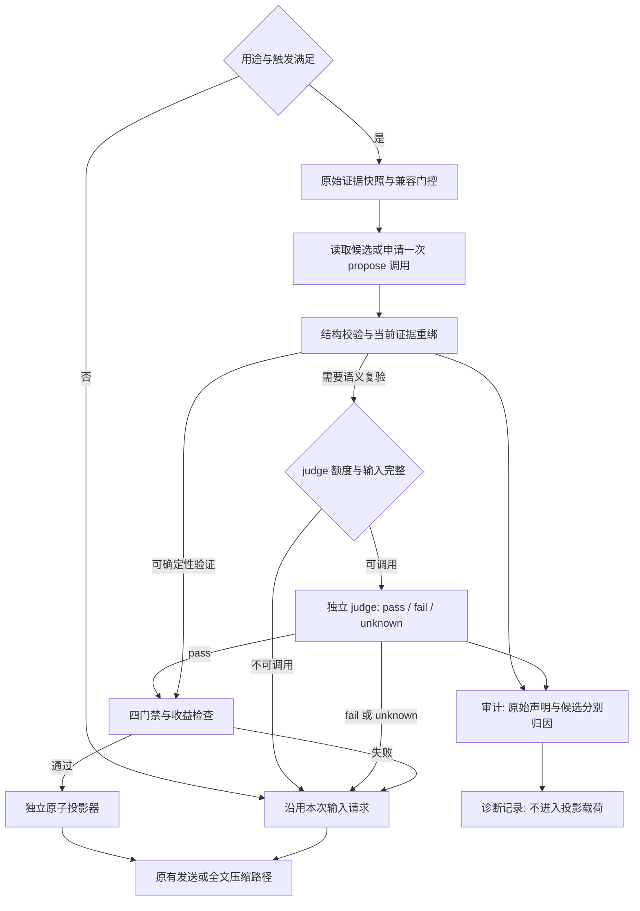

# 内化推理蒸馏：开发设计与验收规格

- 日期：2026-09-22，第 4 版。
- 状态：提案。产品实现未开始；文档检查通过不代表产品、模型质量或上游兼容性通过验收。
- 调研基线：`cedcfb3647e50d9a25633b65e4f3e599adc7fb6c`；`origin/dev` = `f3f4e50a0164c3b11b3b0126b2cd9c1ebe25dc37`。实施前重新核对开发分支。
- 本次范围：完善设计，不修改产品代码、用户配置或原始历史，不部署、不创建 Issue 或提交。

## 0. 修订依据

第 2、3 版已经明确逐槽位保护、独立投影器、保留契约与审计载荷隔离，但复审发现这些约束在类型、算法和验收之间没有闭合。本版替换旧规则，不保留旧版作为并行实现选项。

### 0.1 失败模式与修订映射

本轮修复属于代码设计文档层，不向通用提示词添加规则。实现与测试以 §5、§6 为准，下表记录失败证据、根因和可证伪预测。

| 变更             | 失败证据与根因                                                                                                               | 修订位置           | 预期翻转与代价                                                                       |
| ---------------- | ---------------------------------------------------------------------------------------------------------------------------- | ------------------ | ------------------------------------------------------------------------------------ |
| chg-1 证据粒度   | 只调用 read 就掩盖未执行的计算工具；截断结果或台账丢失被误当成未执行；根因是按轮合并了不同证据维度                           | §5.3、§5.5.1       | 按声明匹配目标调用；缺失结论要求完整清单，截断不抹除调用记录。未知项增加，但不能误判 |
| chg-2 保真判定   | git status 与测试结论只共享文件名就通过；降为 unverified 绕过门禁；fact 未纳入保留；根因是把相关性、自评和集合标签当等价证明 | §4.1、§5.4、§6.2   | 新断言不能靠降级放行；所有有决策影响的信息保留，语义改写单独复验。可能降低命中率     |
| chg-3 复用与成本 | 证据变化后直接复用 verified；一次整理之后再调用 judge 突破上限；根因是候选、验证结论和调用配额生命周期混用                   | §5.6、§5.8         | 命中缓存仍重绑证据；每请求最多一次额外调用。需要 judge 的新候选可能延后到下一次触发  |
| chg-4 边界授权   | 合法讨论 confidence 被过滤；W1 仅因是字符串就放行；根因是用词汇或载荷形状代替来源和兼容证据                                  | §2.1、§5.5.3、§6.1 | 合法同名源码保留；未经上游验证的 W1 仍保护。默认启用不等于默认改写所有模型           |

上一轮正确的约束继续保留：台账不作执行权威、不放松折叠等值守卫、模型审计信息不进入被审计模型的载荷。原文中的旧三态、Ledger 单调性公式和直接缓存投影规则已由本版替换。

## 1. 已核实的实现边界

以下是现有源码事实，不是新功能已具备的能力。图谱提供定位，关键结论以源码为准；索引无已记录缺口不代表绝对完整。

| 接缝或原语       | 源码证据                                                                                                                         | 对设计的约束                                                                             |
| ---------------- | -------------------------------------------------------------------------------------------------------------------------------- | ---------------------------------------------------------------------------------------- |
| 折叠候选采集     | `packages/opencode/src/session/context-folding.ts:199-284`，只采 tool part，按 step-start 分段                                   | 新增独立思绪快照；不复用 duplicatePlan 作为思绪内容模型                                  |
| 工具正文完整性   | 同文件 `:226-234` 检查 completed、compacted、truncated、outputPath                                                               | 这是正文可折叠条件，不是调用是否发生或结果为真的证明                                     |
| AI SDK 接缝      | `packages/opencode/src/session/llm.ts:368-397`，provider 变换后投影                                                              | 读取变换后的槽位；不把中间消息对象误当最终 provider HTTP JSON                            |
| Native 接缝      | `packages/opencode/src/session/llm/native-runtime.ts:107-154`                                                                    | 变换后构造 canonical request，在协议下降前投影；需要目标协议能力信息                     |
| Core runner 接缝 | `packages/core/src/session/runner/llm.ts:350-396`                                                                                | 独立适配；折叠后的请求还会交给 compactIfNeeded，未发送的投影不得计节省量                 |
| 全文压缩输入     | `packages/opencode/src/session/compaction.ts:305-342`                                                                            | 已有历史选择、插件变换和工具正文截断；思绪采集、证据快照与摘要输入要区分                 |
| 折叠投影器       | `packages/core/src/session/context-folding/projection.ts:78-101`、`:286-289`、`:416-425`                                         | source/witness 正文相等、工具占位符依赖 callID；不直接复用该投影器                       |
| wire 原语        | `packages/core/src/session/context-folding/wire-value.ts` 的 cloneWireValue、readWirePath、writeWirePath、verifyWireValueChanges | 复用私有副本、读写路径和变更校验；思绪投影持有独立守卫                                   |
| 请求预算         | `packages/core/src/session/context-folding/budget.ts:19-23`、`:49-63`                                                            | 当前软阈值是可用输入量的 70%；未知预算不能当作未超限或任意触发                           |
| 无损编码         | `packages/core/src/session/context-folding/normalize.ts:123-138`                                                                 | normalizeParameters 是 JSON-like 参数的确定性无损编码，不是去空白或语义正文归一化        |
| 来源台账         | `packages/core/src/session/context-folding/tool-source-ledger.ts:80-120`                                                         | 只存身份和 instructions，有界淘汰、generation 清空；仅作注册来源佐证                     |
| 小模型解析       | `packages/opencode/src/provider/provider.ts:1844-1869`                                                                           | 可复用 getSmallModel 的配置、hook 与 not-found 处理；解析成功不证明运行时可调用          |
| judge 范式       | `packages/opencode/src/goal/judge.ts:6-44`、`:47-91`                                                                             | 只借鉴 verdict/reason/parseFailed 和故障退化；目标完成判据及其解析器不能直接当蒸馏验证器 |

配置扩展点是 `packages/core/src/config/compaction.ts`；宿主服务遵循 `packages/opencode/AGENTS.md` 的 AppLayer / InstanceState 约定。新模块不扩大既有折叠类型的语义，不要求改动折叠守卫。

## 2. 思绪槽位与兼容证据

### 2.1 形态不等于改写授权

W1/W2/W3 描述可定位的候选形态，**并不自动授予改写资格**。资格由目标请求的兼容证据和保护规则共同决定。

| 形态                     | 现有行为与证据                                                                                                                         | 候选粒度                                                                                   |
| ------------------------ | -------------------------------------------------------------------------------------------------------------------------------------- | ------------------------------------------------------------------------------------------ |
| W1 interleaved 字符串    | `packages/opencode/src/provider/transform.ts:316-345` 将 assistant 的 reasoning parts join 到 openaiCompatible 字段；OpenRouter 有例外 | 每消息一个 wire 槽位；内部保留有序 part 身份及跨度，不能把工具发生前后的断言合并为同一时点 |
| W2 无签名 reasoning part | 同文件 normalizeMessages 的清洗与签名过滤逻辑；无签名不证明上游接受改写                                                                | 每个 part 的 text；保持 part 数量和相对位置                                                |
| W3 跨模型降级 text       | `packages/opencode/src/session/message-v2.ts:366-372`；`packages/core/src/session/runner/to-llm-message.ts:98-101`                     | 必须有“该 text 来自 reasoning”的身份映射，不能改写普通 assistant 正文                      |

| 保护规则                 | 含义                                                                                                   |
| ------------------------ | ------------------------------------------------------------------------------------------------------ |
| P1 签名/不可透明解释载体 | Anthropic signature、Bedrock signature/redacted 原样保护；不因拼成字符串或换模型而推定签名已无效       |
| P2 加密或 item 引用      | OpenAI Responses 的 item_reference / encrypted_content 原样保护；首版该协议不改写 reasoning            |
| P3 存在性与结构          | 必须保留的字段、part、分隔符和顺序不变；空字符串是否允许由适配契约决定，不把“字段存在”误写成“必须非空” |
| P4 未结算或身份不明      | 还在流式追加、步骤边界不明、来源映射不唯一时保护；工具正文 complete 不能代替 reasoning 结算判定        |
| P5 未取得兼容证据        | W1/W2/W3 均适用；不以 provider 名称、npm 包名或纯文本形状推定安全                                      |

签名与加密约束可见 `packages/llm/src/protocols/anthropic-messages.ts:449-455`、`packages/llm/src/protocols/bedrock-converse.ts:353`、`packages/llm/src/protocols/openai-responses.ts:384-401`、`:440-446`。DeepSeek 补空 reasoning 的行为见 `packages/opencode/src/provider/transform.ts:297-312`；结构分隔符见 `packages/opencode/src/session/message-v2.ts:276-289`。

**兼容证据记录**绑定 runtime、协议、provider/model/variant、endpoint 身份、适配器版本和相关请求选项的指纹，不含密钥。配置或适配器变化后不继承旧授权；代理 endpoint 的证明不自动覆盖同名模型的其他上游。

启用记录需要两种证据：本地可控 transport 测试证明字段替换与未授权路径不变；真实目标上游的原文/投影对照证明多轮回放、工具续接和结算未退化。Mock 成功只证明适配逻辑，不证明上游兼容；真实上游成功也不替代 §6 的语义保真测试。记录未具备时 P5 保护，不称为“已支持”。

### 2.2 用户配置的已知形态

上一轮读取的本地配置中，small_model 为 `local-proxy-compatible/deepseek`；多个 compatible 模型配置了 `interleaved.field = reasoning_content`，另有 Anthropic 通道和外部 think MCP。这是当时的配置观察，不是本版重新实测上游的结果，也不是可发布的兼容白名单。

该 compatible 配置说明 W1 值得优先验证，但尚不能得出“完全可改写”或“全部历史思绪均被上游计费”的结论。成本需要用实际发送载荷和 usage 证明。默认开启功能时，这些槽位仍受 P5 门控。

## 3. think 内化的含义与边界

目标是**回传信息的 think 化**：将合格槽位中的原始思绪替换为结构化的决定、反方意见、约束、前提、事实状态及证据引用，而不是新增一套 think/recall 工具。分类仅组织渲染，不决定哪些信息可以删除。

| 原有能力      | 内化后的对应能力                         | 不承诺的等价性                                   |
| ------------- | ---------------------------------------- | ------------------------------------------------ |
| 结构化草稿    | claim graph 与原文锚点，按需渲染可读分节 | 事后整理不能强迫模型在行动前思考                 |
| 会话内 recall | 仍可见且合格的历史槽位自动携带已验证投影 | 不等于主动检索，也不保证全文压缩后仍保留全部历史 |
| 诊断反馈      | 独立 AuditRecord，记录可核验结论和未知项 | 不把审计指控回注被审计模型                       |

原始历史仍是证据权威，claim graph 是本功能的派生表示，不是第二份历史真源。claim store 不持久化；会话关闭、重启或全文压缩后不能承诺无损 recall。

外部 think MCP 不自动移除，也不被本功能解析或改写；它与本功能并非严格冗余。其工具结果仍遵循原有工具折叠/全文压缩规则。不注册原生 think/recall 工具，不改用户配置。

## 4. 已确认目标与形式化边界

| 编号 | 已确认目标                   | 本版解释                                                           |
| ---- | ---------------------------- | ------------------------------------------------------------------ |
| D01  | 内化，无外部 MCP/插件依赖    | 共享核心与宿主适配承担                                             |
| D02  | 默认开启                     | 开关默认开启，兼容授权仍默认保护                                   |
| D03  | 仅在压缩/动态压缩触发时执行  | 无后台任务；每请求只做有界开关、用途和预算判定，不做无条件模型整理 |
| D04  | 替换而非附加回传思绪         | conversation 中原槽位替换；不旁路添加额外消息                      |
| D05  | 协议保护优先                 | 无兼容证据不改写；收益不能覆盖保护失败                             |
| D06  | 不写回原始历史               | 缓存、验证、审计和投影均为派生数据                                 |
| D07  | 小模型 → agent 模型 → 主模型 | 分级解析与实际尝试区分，所有实际调用共用预算                       |
| D08  | 信息守恒审计                 | 按具体声明核对证据；违反规则不等于证明模型具有欺骗意图             |
| D09  | 结构化、可回溯               | 每条 claim 有原文锚点，支持证据与来源锚点分开                      |
| D10  | 回传信息 think 化            | 正反意见与理由保留，不以工具式 think 替代                          |
| D11  | 安静、可关闭                 | 诊断不含正文；关闭后不应用已有候选缓存                             |
| D12  | 与折叠、全文压缩独立验收     | 各自计收益和回归，验证组合次序                                     |

### 4.1 决策等价下的最小表示

目标是最小化 `|R'|`，保留 `R` 中会影响后续行动、适用范围和可核验性的全部信息。`R` 是带原始顺序、角色与 part 身份的思绪，`E` 是本次快照中可定位的来源与执行证据。

“对任意后续 agent 都决策等价”是优化目标，不是现有算法能证明的定理。实现通过保守门禁和独立实验逼近；未知不计为通过。标签列表不是有效信息的穷举，无归类但可能改变后续判断的片段必须原文保留。

| 判据         | 可检验契约                                                                           |
| ------------ | ------------------------------------------------------------------------------------ |
| 可重建       | 六类 claim 及未分类但有意义的信息、反方理由、scope、时序与依赖关系均可恢复           |
| 无新增命题   | R' 的实质命题必须来自 R；E 只用于绑定和核验，不授权整理模型顺手添加 R 中不存在的结论 |
| 可核验       | verified 必须有本次仍有效且确实支持命题的 E；原文来源本身不证明其内容为真            |
| 不确定性守恒 | 假设、计划、未核验断言和历史已失效状态不能渲染成已完成事实                           |

模板分节、来源 ID、状态标签是受控渲染元数据，不属于新增实质命题。标识符集合包含关系只能查出部分新增，不能证明“测试未通过”与“测试通过”等价。新增断言即使标成 assumed/unverified 也不能进入投影。

## 5. 方案

### 5.1 触发、用途与组合顺序

触发判据仍是待确认的产品项：预算超软阈值，还是 duplicatePlan 非空。推荐前者，因为没有重复工具正文的长思绪也有上下文压力。若采用前者，复用 `ContextFoldingBudget.overBudget === true`，不再另设含义模糊的“超软阈值”分支；不依赖 `compaction.dynamic` 开关。

| 用途                | 允许行为                                                                           | 回退                                           |
| ------------------- | ---------------------------------------------------------------------------------- | ---------------------------------------------- |
| conversation        | 触发后对已结算、已授权槽位生成或复验候选，再原子替换                               | 发送本次蒸馏输入请求；不回退已经独立完成的折叠 |
| compaction          | 在宿主显式选定的摘要输入副本中，以已验证产物替代对应明文片段，不同时附加原文与投影 | 继续既有全文压缩，不因蒸馏失败取消摘要         |
| auxiliary / unknown | 不采候选、不调用蒸馏模型、不应用缓存                                               | 保持原路径                                     |

compaction 的“替代摘要输入”不是篡改 provider 签名载体：只能操作原本已被选入摘要输入、可合法明文表示的片段；不解密、不解引用受保护的 P1/P2 内容，不为增加收益额外翻出被隐藏历史。若该输入仍携带受保护协议结构则跳过。全文摘要的保留质量另行验收，不能因上游蒸馏通过便称摘要保真。

三条运行时固定同一逻辑顺序：从未投影历史采证据快照 → 原有工具折叠 → 在折叠结果上重算蒸馏预算、绑定槽位并投影 → 原有发送或压缩判定。证据不从折叠占位符反推；两类候选不能互相删除。

每层对自己的输入原子操作。折叠成功但蒸馏失败时保留折叠结果；发送前任一后续变换影响已验证路径、工具定义或证据映射，重新校验或撤销本次蒸馏。Core runner 随后决定全文压缩时，未发出的会话投影不计实际节省；compaction 与 conversation 共用同一逻辑准备周期的额外调用额度，不通过改 purpose 重新领额度。

### 5.2 模块与执行流程

共享核心拟放在 `packages/core/src/session/reasoning-distillation/`，独立持有 claim、证据匹配、规划、验证和审计契约。宿主提供模型调用、持久化历史只读快照、兼容证据、生命周期与预算；纯函数消费这些观察值及显式模型结果，不执行 I/O，也不把 LLM 抽取伪装为确定性解析。



1. 快照保留原始 part/step 顺序、来源跨度、调用清单覆盖范围和完成状态；不以当前模型可见窗口等同完整历史。
2. 宿主按 §2 分类、核对兼容记录；没有可改写槽位时只做已具备输入的有界确定性审计，不追加付费调用。
3. 命中候选缓存也先按当前证据复验；未命中时受 §5.8 限制申请 propose。模型仅产候选，不授予投影权限。
4. 校验失败仍可记录可靠的审计发现，不让“先通过保真才审计”吞掉 fabricated/concealed；证据不全只记录 unknown。
5. 语义未决且没有调用额度时缓存候选、发送原文；只在下一次已有压缩触发时尝试 judge，不创建定时器或自动 continuation。
6. 投影器只接收通过门禁的本请求结果；写诊断时不包含原文、候选正文、命令参数、工具输出或自由文本 judge 理由。

**复用边界**：复用 wire 私有副本、路径读写、变更验证、无损序列化、请求指纹和预算估算。新设 `projectDistillationRequest`，不调用 `projectContextFoldingRequest`，不放松 source/witness 等值守卫。

独立投影器校验 refs、来源指纹、目标协议、兼容记录、请求指纹、允许变更路径和 P3；任一步失败返回传入的**同一请求对象**。幂等绑定来源/目标指纹和请求级标记，不靠在自然语言中搜索特殊前缀。重复调用不得双重包装，也不能因用户正文恰好出现标记词而误判已投影。

### 5.3 数据契约

下面是设计类型，不是已实现 API。`Readonly` 在实现中扩展到所有嵌套结构；运行时 schema 校验承担数组非空、范围合法、指纹一致和联合字段约束。

```ts
type SourceRef = { messageID: string; partID: string }
type SourceSpan = SourceRef & {
  start: number // UTF-16, [start, end), relative to the original part text
  end: number
  fingerprint: string
}
type EvidenceRef = SourceRef & {
  kind: "instruction" | "source" | "tool-input" | "tool-result"
  callID?: string
}
type ClaimKind = "fact" | "constraint" | "decision" | "rejection" | "assumption" | "state_delta"
type ClaimStatus = "verified" | "unverified" | "assumed"
type Claim = {
  id: string
  kind: ClaimKind
  text: string
  scope: string
  sources: readonly SourceSpan[]
  evidence: readonly EvidenceRef[]
  status: ClaimStatus
  supersedes?: string
}
type ExecutionTarget = {
  id: string
  claimID?: string // A requirement-only target need not appear in the reasoning
  modality: "reported" | "required"
  requiredBy: readonly SourceRef[]
  toolName: string
  inputFingerprint?: string
  selector: { kind: "call"; callID: string } | { kind: "at-least-one" | "all" }
  expectation: "invoked" | "succeeded"
  scope: { messageIDs: readonly string[]; stepIDs: readonly string[]; settled: boolean }
}
type CallObservation = {
  ref: EvidenceRef & { callID: string }
  toolName: string
  inputFingerprint?: string
  status: "pending" | "running" | "completed" | "error" | "interrupted" | "unknown"
  result: "complete" | "truncated" | "compacted" | "missing"
  provenance: "corroborated" | "unavailable"
}
type ExecutionMatch =
  | { kind: "matched"; calls: readonly CallObservation[] }
  | { kind: "absent"; inventoryFingerprint: string }
  | { kind: "unknown"; reason: "incomplete-inventory" | "ambiguous-target" | "unsettled-scope" }
type SupportResult =
  | { verdict: "supported" | "contradicted"; method: "deterministic" | "judged" }
  | { verdict: "unknown"; reasonCode: string }

type ReasoningSlotShape = "interleaved-field" | "unsigned-reasoning" | "downgraded-text"
type SlotEligibility =
  | { allowed: true; capabilityFingerprint: string }
  | { allowed: false; protection: "P1" | "P2" | "P3" | "P4" | "P5" }
type WireReasoningMapping = {
  refs: readonly SourceRef[]
  shape: ReasoningSlotShape
  eligibility: SlotEligibility
  bodyPath: readonly (string | number)[]
  sourceFingerprint: string
}
type ModelTier = "small" | "agent" | "primary"
type DistillationKey = {
  sessionID: string
  messageID: string
  partIDs: readonly string[]
  sourceFingerprint: string
  capabilityFingerprint: string
  organizerFingerprint: string // Actual provider/model/variant/options, not only tier
  policyVersion: string
}
type CoverageEntry =
  | { source: SourceSpan; action: "keep"; claimID: string }
  | { source: SourceSpan; action: "preserve" }
  | { source: SourceSpan; action: "merge"; witness: SourceSpan }
  | { source: SourceSpan; action: "drop"; reason: string }
type Candidate = {
  key: DistillationKey
  fingerprint: string
  claims: readonly Claim[] // Status and evidence remain proposals until validation
  preserved: readonly SourceSpan[] // Meaningful text that cannot safely be classified
  coverage: readonly CoverageEntry[]
}
type ValidationStamp = {
  candidateFingerprint: string
  evidenceFingerprint: string
  capabilityFingerprint: string
  validatorVersion: string
  judgeFingerprint?: string // Required when method is judged
  method: "deterministic" | "judged"
}
type ModelProjection = {
  claims: readonly Claim[]
  preserved: readonly SourceSpan[]
  text: string // Rendered only from validated claims and preserved source spans
}
type AuditViolationKind =
  | "fabricated"
  | "concealed"
  | "simulated_execution"
  | "unbacked_completion"
  | "evidence_swap"
  | "unverifiable"
type AuditRecord = {
  subject: "source-agent" | "distiller"
  findings: readonly {
    kind: AuditViolationKind
    claimID?: string
    targetID?: string // At least one of claimID / targetID must resolve
    evidence: readonly EvidenceRef[]
    confidence: "deterministic" | "judged" | "unverifiable"
    reasonCode: string
  }[]
}
type DistillationPlan = {
  replacements: readonly {
    mapping: WireReasoningMapping
    projection: ModelProjection
    validation: ValidationStamp
    estimatedSavings: number
  }[]
  audit: readonly AuditRecord[]
  reusedCandidates: readonly DistillationKey[]
  extraCall: "none" | "propose" | "judge"
  skipReason?: string
}
```

`ExecutionMatch.matched` 要求 calls 非空；absent 要求已结算的明确目标和完整调用清单证明。工具证据要求 callID 与持久化 part 一致。required 目标的 requiredBy 非空；reported 目标必须能定位原始声明。findings 至少一个 claimID/targetID 可回溯，不为填字段虚构 R 中不存在的 claim。status 使用宿主明确映射的语义，不能把运行时未知状态强制转换成 completed。

SourceSpan 只证明 claim 来自哪里；EvidenceRef 才用于支持关系。scope 必填，保留时间、环境、对象与条件；“不知道 scope”必须原文保留或跳过，不能默认全局。`supersedes` 指向被否决的旧 claim，目标仍保留身份、原主张和适用范围；不得成为悬空引用，也不能把旧主张渲染为仍有效的决定。

skipReason 使用封闭枚举实现：保留适用的预算/映射原因，新增 `no-rewritable-slot`、`compatibility-unproven`、`retention-contract-violated`、`new-assertion`、`evidence-unresolved`、`semantic-review-required`、`model-tier-unresolved`、`call-budget-exhausted`、`attempt-exhausted`、`insufficient-net-savings`、`stale-validation`。不盲目复制只适用于工具 source/witness 的原因。

### 5.4 有效信息与四门禁

**保留单位**是会影响未来判断的信息，不是 ClaimKind 白名单。六类都纳入保留：decision、rejection 及理由、constraint、assumption、fact、state_delta；未分类但无法证明无影响的片段进入 preserved。删除 fact（如目标区域不支持所需服务）同样可能改变决策。

“左右互搏”保留被否决的选项、理由及后继结论；没有 supersedes 边不代表无价值。模型提出的 repeat/dead_end/digression/restatement 只能是删除建议，不能自行授权删除；跨 scope、时间或依赖的相同文本不能当作同一事实。

候选必须提交原文覆盖映射：每个有内容的源片段对应保留 claim、preserved，或带 witness/理由的合并删除项。未覆盖片段不能静默消失。最终判定读取完整 R，而不是只比较候选模型自己抽出的 claim 集，否则抽取遗漏会同时污染“标准答案”和投影。

| 门禁          | 通过条件                                                                                   | 失败处置                                                                          |
| ------------- | ------------------------------------------------------------------------------------------ | --------------------------------------------------------------------------------- |
| G1 无新增命题 | 每个输出命题绑定 R 的跨度，否定、完成性、条件和数值未变；来源之外只允许受控模板元数据      | 新断言直接拒绝；标成 unverified/assumed 不能绕过                                  |
| G2 信息保留   | 六类、preserved、scope、时序和依赖完整重建；scope 不删除、不收窄也不扩大；删除建议经过验证 | 任意遗漏、改义或未决均拒绝本候选；不以高压缩率抵消                                |
| G3 引用完整   | 来源/证据在本次快照真实存在、身份与授权范围正确、时序相容；不引用未来结果来证明当时已知    | 无法绑定则保留原文；不以来源相同证明内容为真                                      |
| G4 命题支持   | verified 的每条命题有针对性的支持证明；调用完成性与结果内容分别检查                        | 原文已有断言可如实保留为 unverified，不能删掉或改成更强断言；新增命题仍由 G1 拒绝 |

时序相容要到 step/part 粒度，不以“同一 assistant 消息”放行未来证据。路径、符号重叠只用于检索候选证据，**不是语义蕴含**。`git status` 显示 `src/a.ts` 不支持“该文件的测试已通过”；tool part 的 completed 只表示该调用按工具契约结算，不证明任意 state_delta 为真。bash 的 completed 也不能替代实际退出码与测试结果。

非工具证据同样有适用范围：用户明确给定的约束可由指令支持，不要求 completed tool；读取源码只支持相应版本的源码事实，不证明外部部署成功。原文中的错误断言不会因蒸馏自动变成事实，审计按 §5.5 另行归因。

**验证方法**：确定性层只能批准具有实际校验规则的变换，例如完全相同范围内的精确表示保留、已解析的结构化状态谓词；规则与反例必须随实现提供。一般语义改写、噪音删除、支持或反驳需要独立 judge，输出 pass/fail/unknown 并绑定跨度与证据。不能用 proposer 的自评替代 judge；judge 不看其自评或生成过程，只看 R、候选、当前 E 和契约。独立指单独上下文调用，不承诺不同模型家族。

judge 的 pass 仍是 `judged` 而非数学证明。宿主随后重跑结构、范围、证据身份和请求指纹校验；judge 无权覆盖缺失证据、协议保护或预算限制。输出不全、解析失败、截断输入、意见无法落到具体跨度时都按 unknown。无额度时保持原文，不能为了命中把未决改为 pass。

### 5.5 守恒审计

“欺诈”是本功能对可核验违规的产品称呼，不推断主观意图。原始 agent 未履行工具要求，与整理模型添加/隐藏信息分别标注 `source-agent`、`distiller`，不能把蒸馏器制造的问题归罪于原始 agent。

#### 5.5.1 声明级证据与独立维度

每次审计先确定 ExecutionTarget：原文在声称哪个工具/命令已经发生，或用户明确要求哪个操作在何时完成。计划、举例、预测输出不等于执行声明；要求尚未到履行边界时不判遗漏。requiredBy 保留指令出处，范围由真实步骤和请求关系确定，不由模型随意扩大。

| 维度       | 权威输入                                                         | 不能推出的结论                                                   |
| ---------- | ---------------------------------------------------------------- | ---------------------------------------------------------------- |
| 声明匹配   | 目标工具、可核验参数、关联 callID、步骤/时间范围与持久化调用清单 | 本轮有任意工具就完成了目标操作                                   |
| 清单覆盖   | 宿主对范围内原始持久化消息/parts 的完整读取及边界证明            | 当前上下文看不到 tool part 就从未调用                            |
| 结算状态   | 匹配调用的 pending/running/completed/error/interrupted 状态      | 有 tool part 就实际执行成功；权限拒绝也可能产生失败记录          |
| 结果完整性 | 输出正文、compacted/truncated/outputPath、附件可解释性           | 正文被清理就不存在调用记录；未读取外部 outputPath 就拥有完整结果 |
| 注册来源   | tool-source-ledger 身份，缺失为 unavailable                      | 台账查不到就改变 matched/absent，或证明某命题为假                |

ExecutionTarget.selector 明确指定 callID 或 at-least-one/all 量词，expectation 区分调用与成功；all 需要已确定的有限目标集合，否则 unknown。其次匹配规范化工具名、参数和声明范围；参数采用无损编码，不改命令空白、引号、大小写或路径。指定某次调用就不能拿另一成功重试替代。多个候选无法消歧、shell 包装或工具别名无已验证匹配规则时为 unknown，不强行判 absent。声称“当时已完成”还需要调用与结算早于断言时点的证据，不能用后来最终状态倒推。

absent 只能由“目标明确、范围已结算、清单完整、无匹配调用”产生。同轮调用 read 不阻止针对计算工具的 absent；反过来，工具运行失败但留有匹配记录是 matched，不是 simulated_execution。若宿主无法证明清单完整，首版只能给 unknown，不新建持久化审计账本来补足。

正文截断时仍保留 matched 和已知结算状态；仅依赖被截断内容的命题支持为 unknown。持久化记录完整但在当前 wire 中不可见时，审计可使用已读原始快照，但不能将其冒充为模型当前可见证据。原始快照本身已裁剪或不可定位则 unknown。台账 generation 变化只影响 provenance，不抹除调用事实。

#### 5.5.2 排他判定与归因

同一执行声明按下表自上而下判定；执行类发现互斥。审计的是具体命题，不是“该轮好/坏”。

| 条件                                                                         | 结论                                                                          |
| ---------------------------------------------------------------------------- | ----------------------------------------------------------------------------- |
| 不是执行声明/已到期要求，或只是计划、预测、示例                              | 不作执行违规标注；未结算候选受 P4 保护                                        |
| 目标、范围、匹配或必要证据未知                                               | 仅 unverifiable；judge 不能凭空补执行记录                                     |
| 匹配为 absent，且明确声称使用工具，或在结束时仍未履行明确工具要求            | simulated_execution；即使计算答案本身正确也不等于完成工具要求                 |
| matched，原文声称该调用成功结算但状态失败/中断，或针对性证据反驳具体完成命题 | unbacked_completion；不能标成从未调用，也不能把调用失败等同于全部副作用未发生 |
| matched 但完成性/结果不足以支持或反驳声明                                    | 仅 unverifiable；不能仅因“未找到成功证据”断言失败                             |
| matched 且针对性证据支持，或原文明示实际失败                                 | 不作违规标注                                                                  |

fabricated、concealed、evidence_swap 分别记录已证明的新增命题、删失必要信息、错绑证据，来源是 G1/G2/G3/G4 的失败证据。语义判定标 judged；精确身份/结构谓词才可标 deterministic；无法确定为 unverifiable。失败候选不能发送，但可靠的失败诊断不能因此消失。

#### 5.5.3 来源与载荷隔离

渲染器只接收经过验证的 claims、preserved 及原文解析器，不接受 AuditRecord、judge 自由文本理由、违规计数或诊断对象。投影字符串重新构造，不拼接整个模型 JSON。独立 schema 拒绝额外字段，类型声明不能代替运行时隔离。

隔离的是**本次审计生成的数据来源**，不是词汇。用户要求修改 `confidence` 字段、讨论 `simulated_execution` 枚举或分析既有审计日志时，相关原文照常保留。原文明确的失败、否决和假设也必须保留，不能用“负面信号只能是 unverified”删除它们。

诊断仅存 ID、reasonCode、枚举、计数、指纹和耗用；原始输入及候选只在实例内存和受限辅助请求中处理。若后续 UI 显示详情，从原始历史按权限定位，不把正文写进公共事件。

辅助模型将 R、候选和工具输出视为不可信数据；无工具执行权限、不进入普通会话历史、用途固定为 auxiliary，不递归触发蒸馏。数据中的“忽略规则、调用工具、输出审计对象”等指令不得改变预算、兼容门控和解析契约。不得根据模型给出的路径去读取额外文件或外发未选入快照的数据。

### 5.6 模型分级与复验调度

propose 和 judge 都按小模型、当前 agent 模型（compaction 使用其 agent）、会话主模型的顺序解析，记录实际 provider/model/variant、选中档位和回退原因。解析阶段去重相同模型，只做本地可用性与上下文能力检查，不通过探测请求免费试错。

请求发出前的 not-found/配置不可用可继续解析下一档；**发出后**的网络失败、超时、解析失败或质量失败都消耗一次实际尝试。本请求不再换模型调用，SDK/transport 自动重试关闭。全部不可用进入 deterministic-only，不生成或应用需要该次模型验证的新投影。

首次 propose 用完本请求额度后，需要语义审阅的候选保持 pending；下一次既有压缩触发先审阅 pending，再处理新候选。judge 从当前分级配置解析，使用独立上下文；验证证书记录具体验证器/模型身份。不存在下一次触发就不审阅、不投影，不安排后台补跑。

若缓存已有仍有效的候选与语义证书，只需确定性复验，无额外调用。若所有模型当前不可用，只有不需要新语义判断且证书、兼容授权均有效的旧候选可以复验；开关关闭则一律不应用。这个缓存路径不被记为一次新的模型成功。

### 5.7 开关与生命周期

拟在 `packages/core/src/config/compaction.ts` 的 Info 同层增加 `distill`，默认 true，并提供独立环境禁用位和 source 归因。实施时沿现有配置加载链核对 V1 schema、迁移和 AppLayer，不借用 dynamic 的解析结果作为蒸馏开关。

`compaction.dynamic: false` 不禁用蒸馏，蒸馏关闭不禁用折叠或手动全文压缩。关闭后停止 propose/judge 和缓存投影，清除本功能派生内容；保留实例内的已耗用计数，避免反复切开关重置调用额度。关闭不撤销既有全文摘要或历史清理。

claim store 由宿主按 InstanceState 管理，以 location/session 隔离，实例关闭或 session 删除清理，不持久化、不跨 session 查询。缓存只保存有界的候选派生内容和验证元数据，不另存整份原文副本。历史界面、导出继续展示原始记录。

用户说明：**上下文压力出现时，在兼容性和信息保留校验通过后替换冗长思绪；无法核验则保留原文。审计诊断与模型回传分离，全文压缩和动态折叠保持独立。**

### 5.8 复用、调用与成本边界

**候选缓存不是通行证。** 每次使用均重新读取本次证据、核对开关和兼容记录、验证来源与目标映射，最后才构造 ModelProjection。

| 数据     | 身份与失效规则                                                                                                 |
| -------- | -------------------------------------------------------------------------------------------------------------- |
| 原文身份 | session + message + 有序 partIDs + 原始字符串的无损指纹；不去空白，不忽略否定、引号或 surrogate 差异           |
| 候选键   | DistillationKey；实际整理模型/variant/options、兼容记录或策略版本变化即失效，不只比较 small/agent/primary 档位 |
| 语义证书 | 绑定 candidate、原始/证据跨度、相关指令、调用清单覆盖、状态、正文完整性、可见性和验证器版本指纹；变化即失效    |
| 请求授权 | 请求指纹与允许变更路径每次重算；不能用旧请求指纹替代新证据验证                                                 |
| 来源佐证 | 台账淘汰或 generation 丢失重算 provenance，不单独重做付费抽取；若确实影响匹配则回到 unknown                    |

证据被截断、删除或移出当前可引用范围时，不能沿用旧 verified、审计结论或原先估算的 savings。重新绑定后能确定性确认的重新确认；需要新的语义审阅但额度已耗尽则保留原文，不能降级标签后直接复用。AuditRecord 每次按当前证据生成，不作为缓存权限。

缓存条目初始上限 4096，总派生正文上限 16 MiB，两者先到者按插入序淘汰；单项超过剩余预算可跳过缓存。取消、session 删除或 instance 关闭后返回的异步结果不得重新插入缓存或覆盖新版本。

**统一调用预算**：propose、judge（保真与审计合并为一次审阅）、真实失败和任何重试均计入额外模型调用；当前工具折叠本身无需模型。全文摘要本身是原有基线调用，单独计量，不用它掩盖蒸馏开销。

| 维度           | 首版设计约束                                                                                                                                                                                                              |
| -------------- | ------------------------------------------------------------------------------------------------------------------------------------------------------------------------------------------------------------------------- |
| 每逻辑准备周期 | 最多一次额外模型尝试，conversation → compaction、provider 重试或 Native → AI SDK 回退不能重置                                                                                                                             |
| 每原文身份     | propose 至多一次、judge 至多一次，总共至多两次，分布在不同触发周期；模型或证据指纹变化不重置该配额                                                                                                                        |
| 失败           | 不自动重试；失败阶段额度耗尽。propose 失败不再付费 judge；judge 失败或未知则原文保护                                                                                                                                      |
| 并发           | 发起调用前原子预留阶段与总额度，同一工作共享 in-flight 结果；取消也不返还已发送尝试                                                                                                                                       |
| 输入/输出      | 输入最多 32768 估算 token，输出最多 4096 token，并受选中模型更小限制；不得为塞入预算静默裁剪必要证据，不能满足则跳过                                                                                                      |
| 时限           | 单次 30 秒硬超时，传播父 abortSignal；超时/取消后迟到结果不能投影                                                                                                                                                         |
| 会话实例总量   | 每 session/instance 硬限 32 次额外调用；262144 个辅助 token 是准入预留额度，不是真实计费硬上限。调用前要求已对账耗用 + 在飞预留 + 本次输入估算/输出上限预留不超过额度；返回后按 usage 对账，缺 usage 保留预留并标计量未知 |
| 账目存储       | 4096 个原文身份上限；满后停止新付费工作，不淘汰尝试记录换取新额度；候选淘汰、开关切换不重置计数                                                                                                                           |

这些数值是首版待基准验证的工程默认值，不是实测结论。无持久化意味着重启实例后重新开始计数，不能宣称跨重启的 session 终身上限。token 估算可能低于真实 usage，包括协议开销与 provider 推理计费；若无可验证的 tokenizer/计费上界，不承诺累计真实 token 绝不超过准入额度。超预留必须按真实数值记录，进入该 session/instance 的付费暂停状态，停止后续准入；不截断账目、退款式回滚已耗 token 或通过重试继续工作。缺 usage 同样暂停新的付费调用，但仍可复验已有候选。单次输出超限或结构不完整耗尽该阶段额度，不产生有效候选/证书。

每次仅选择一个消息身份执行 propose/judge，pending 审阅优先；不借批量调用绕过原文级配额。账目优先于模型调用创建，禁止先调用后“尽力记账”。

**收益计算**：`estimatedSavings = tokens(original slot) - tokens(rendered projection)`，rendered 已包含分节、引用和状态标签，不再重复减一次产物 token。估计非正不调用或不投影。首次调用前估算最大可能节省及最坏辅助成本；价格/计量口径未知只可记录 token，不声称货币净收益。

付费候选按最多 8 次后续真实发送的摊销窗口准入，保守估算 `8 * 单次节省成本 > propose + judge 的最坏辅助成本`；这只是可证伪预测，不把未发生的未来发送记为收益。请求最终未发送、投影未应用、缓存淘汰、会话提前结束时，已耗辅助成本照常计入。失去正收益或无法估算则跳过新付费工作。

诊断分别记录预算预留、真实尝试与 token、propose/judge 角色、候选命中、验证命中、实际投影次数、未发送投影、节省 token 估算和 usage。总成本验收见 §6.2；压缩率不能抵消安全、误报或成本失败。

## 6. 验收

### 6.1 契约与反例

实现必须将以下反例保存为可执行测试；本次文档修订只给出预期结果，不把它们列为已通过产品测试。

| 用例                                       | 必须观察到的结果                                                           |
| ------------------------------------------ | -------------------------------------------------------------------------- |
| 要求计算工具，实际只调用 read              | 对明确已到期目标判 absent，可产 simulated_execution；无关工具不掩盖遗漏    |
| 匹配调用真实失败，原文声称该调用成功结算   | matched + unbacked_completion；不标 simulated_execution                    |
| 调用失败但可能已经产生部分副作用           | 不据此反驳全部 state_delta，世界状态仍需针对性证据                         |
| c1 失败、c2 成功，工具和参数相同           | selector 指定 c1 不得由 c2 支撑；at-least-one 的成功要求可以由 c2 支撑     |
| 匹配调用失败，原文如实说明失败             | 无违规标注；失败与拒绝理由仍保留                                           |
| 权限拒绝、pending/running、边界未结算      | 不把调用记录当执行成功；在飞思绪保护，不提前判遗漏                         |
| 工具正文截断或清理，状态仍完整             | 保留 matched 和已知状态；仅缺失内容相关支持为 unknown                      |
| 台账 generation 变化或 >4096 淘汰          | 只降低 provenance；完整持久化匹配结果与语义支持不凭空改变                  |
| 原始历史清单不完整且没有匹配项             | unknown/unverifiable，不判 absent 或 unbacked_completion                   |
| git status 与“测试通过”共享路径            | 不授予 verified；无完整反证时也不直接断言测试失败                          |
| 候选新增事实后标 unverified/assumed        | G1 拒绝，不能借标签绕门禁                                                  |
| 删除 fact、scope、反方理由或未分类必要片段 | G2 拒绝；scope 扩大、缩小或跨时间合并同样失败                              |
| 同消息后续工具结果证明前序“已经执行”       | G3 拒绝时序错配，不以同轮为通行证                                          |
| 用户明确给定约束，无工具调用               | 可由指令出处支持，不强制要求 completed tool                                |
| 原文合法含 confidence/simulated_execution  | 内容保留；向独立 AuditRecord 注入唯一 canary，最终 wire 不含该 canary      |
| 原文含伪造幂等标记或辅助模型指令           | 不能改变授权、预算、渲染来源或触发工具执行                                 |
| W1 无签名但缺上游兼容记录                  | 默认开关打开也按 P5 保护；已授权 W1 正例另测                               |
| P1/P2/P3/P4 与 W3 普通正文混排             | 签名/加密/分隔符不动，字段存在性守恒，仅映射到 reasoning 的 text 可改      |
| 缓存后证据变化、跨模型/endpoint/variant    | 重新绑定并使旧证书失效；不能直接返回旧 verified 或 AuditRecord             |
| 首次 propose 需要语义复验                  | 当次最多一次调用且不投影；下一次合法触发至多一次 judge，成功后才投影       |
| judge 无额度、失败、unknown 或无法绑定跨度 | 保留原文，不补调用、不把结果当确定性通过                                   |
| 并发、取消、迟到结果、缓存淘汰、切开关     | 配额先占用且不重置，不复活已失效候选，不重复同阶段调用                     |
| usage 超预留或缺失                         | 记录真实超额或计量未知，暂停后续付费准入；不谎称真实累计耗用仍在估算额度内 |
| 原子替换中途失败、请求指纹变化             | 返回本层输入的同一对象，保留此前独立折叠结果，无半成品                     |

另外验证：source spans 有序且无越界，覆盖映射无漏项，rejection 目标可定位且无错误有效状态，W1 多 part 到单槽映射无碰撞。相同观察值和模型结果得到同一纯函数计划，时间与模型调用只由宿主提供。

### 6.2 行为、质量与成本

**三条路径**：OpenCode AI SDK、OpenCode Native、Core runner 均需真实投影正例与保护反例；捕获实际上行 payload、原始存储不变、调用/结算和最终状态。记录 fallback、插件变换、折叠与 compaction 组合，不把“会话完成”当作替换成功。

**兼容性**：按 §2.1 对每个启用组合保存可控 transport 与真实上游两层证据。W1 测试至少覆盖多 part 拼接、空字段、工具续接、混合签名保护与重复回放；W3 证明不是普通正文。未实测组合保持 P5，不能把 mock 覆盖率标为 provider 支持率。

**重建基准**：至少 20 段真实会话，冻结并人工标注六类 gold claims、scope、否定/时序、supersedes、执行要求和必要的未分类信息。至少 8 段为上表反例；安全用例必须同时包含应该拒绝和应该通过的正反例。训练/提示词调优集与最终留出集分开，修评分提示词后重跑完整留出验收，不复用旧成绩。

原始候选抽取质量与**最终获准投影质量**分开报告。候选可以遗漏并被拒绝，不能把候选平均召回率当最终安全保证。对每个获准替换的样本，仅以 R' 回答关于 R 的结构化问题；gold 覆盖六类及 preserved，不让评分模型看到 R 后自行补全答案。人工复核全部获准样本、全部审计阳性和模型分歧，剩余拒绝样本至少抽样 30%。

| 指标                                | 验收约束                                                                                        |
| ----------------------------------- | ----------------------------------------------------------------------------------------------- |
| 获准投影的六类召回与关系/scope 保留 | 每类及必要未分类信息均为 1.0；无样本的类别补样，不以空分母通过                                  |
| 获准投影的新增、误改和不当升级      | 0；不能允许“少量虚构率”抵消                                                                     |
| 审计正反例                          | 明确可核验违规全部检出，正常与证据未知反例零误判；unverifiable 不计为检出                       |
| 功能非空                            | 每个支持运行时至少一个获准正例；留出集至少 5 个获准样本，且覆盖六类，防止全部跳过伪装安全       |
| 压缩率                              | 在冻结收益子集上，对获准 W1 投影总体目标 ≥40%；同时报告所有候选（跳过计零）的有效压缩率和接受率 |
| 成本                                | 每请求额外尝试 ≤1，每原文身份 propose/judge 各 ≤1、合计 ≤2；同阶段不重试，缓存命中必须实际复验  |

零错误是有限基准上的发布要求，不宣称生产中能数学保证零错。达不到保留要求则收紧策略或修复；达不到 40% 只表示收益未达标，不能放松安全门禁或悄悄更换样本。改变收益目标须显式修订设计并重新验收。

**成本场景**：至少 8 轮、同时包含稳定历史复用与新增思绪；另测单轮结束、全文压缩、证据失效、低复用、取消和失败注入。累计 `extraCalls <= 2 * admittedSourceIdentities` 且不超 32 次硬限；每次准入满足预留额度，超预留或计量未知后无新付费调用；满账目后无新调用；稳定且未失效的同一候选不重复 propose/judge。

长会话收益场景只统计真正应用并发送的节省，辅助实际 token 包括失败、judge 和未复用候选；同一 token 口径下，总辅助 token / 累计节省 token 必须 <1，价格可用时再验证加权总成本同样下降。缺 usage 的样本不能计为成本验收通过。短会话允许出现无法摊销的实际亏损，但必须记录完整成本并满足调用次数硬限与 token 准入规则；真实 usage 超预留按异常路径验收，不假称事后暂停能撤销已耗用量，也不得排除这些样本后声称普遍省钱。

**compaction**：在摘要输入观察到已验证片段替代而非追加；蒸馏失败回到原摘要输入；P1/P2 不被解密或额外暴露；摘要输出和后续一轮行为独立验收，不把摘要模型误丢信息算成蒸馏通过。

### 6.3 实现后的本机检查

本次只改 Markdown，检查全文一致性、示例类型语法和 Prettier。实现后根据最终 diff 执行包级测试，不从仓库根运行 bun test：

- 新核心规划/投影/匹配/缓存与全部 §6.1 反例，以及三个运行时的直接消费者。
- 既有工具折叠测试原样通过，验证等值与占位符行为不被放松；不以源码行号或字符串快照阻止无语义变化的重构。
- 既有全文压缩测试及新组合场景；独立开关经 AppLayer 加载的成功、失败和禁用路径。
- `bun run typecheck`、`bun run lint`；触及 DAG 状态机或持久化时运行 packages/opencode 的 `bun run test:dag-core`。
- 新增公共事件时，两处 event-manifest 测试、固定数量断言、清单和生成物一并核对；若有 UI 呈现则覆盖相关客户端交互。

仓库命令与 CI 映射以 `AGENTS.md` 为准。失败、环境缺失、兼容性未实测如实记录，不能记为通过。

## 7. 待决事项与剩余风险

1. **触发判据，实施阻塞**：预算超阈值还是 duplicatePlan 非空，仍需用户确认。推荐前者；本版不把建议伪装为已确认需求。
2. **实现治理，实施阻塞**：`AGENTS.md` 当前限制新增平台特性。独立 Issue/分支不是豁免；需项目明确允许本功能进入实施范围。默认开启是已确认产品目标，不是越过治理的授权。
3. **兼容授权，启用阻塞**：当前配置只证明 W1 形态，不能生成上游白名单。每个实际启用组合必须完成 §2.1；签名/加密通道收益不对等，不能靠破坏保护补收益。
4. **语义能力上限**：一般命题等价和支持依赖 judged 证据，仍可能误判。需要跨度级证据、留出基准与明确归因；未知不放行，不能宣称模型审阅等同确定性证明。
5. **证据完整性上限**：历史和调用清单可能缺失，导致只能 unverifiable。结果正文清理不抹除调用状态；若需要新增持久化执行账本，那是另一个需批准的范围，不在首版偷偷加入。
6. **成本默认值待校准**：§5.8 的数值和 8 次摊销假设需基准验证。首版采用独立 propose/judge、跨既有触发复验，不合并全文摘要调用；延迟获益及短会话亏损必须实报。
7. **两套投影器**：共享 wire 原语、各持语义守卫；组合顺序与失败原子性是回归重点，不通过固定实现行号来“保护”设计。
8. **think 与 recall**：不自动迁移外部 MCP，不承诺前置思考控制或压缩后的长程检索；若后续需要这些能力，另行定义范围与验收。
9. **审计处置**：首版只诊断，不阻断工具、不改结算或重试、不向被审计模型注入指控；接入 DAG review/verify 或做用户迁移提示属于后续授权范围。

本版的可证伪条件是 §6.1 反例翻转与 §6.2 的安全、非空收益和成本指标同时成立。任何反例仍失败，应修改其所属证据/投影/预算契约并重跑相关基准，而不是添加更强措辞或降低正确预期。
